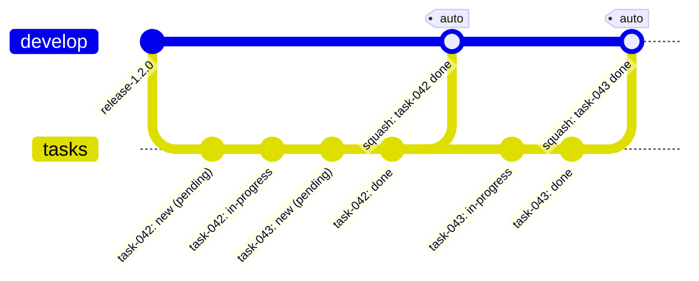

# Taskin

> Modular task management platform with real-time synchronization and LLM integration

[](LICENSE)
[](https://www.typescriptlang.org/)
[](https://vuejs.org/)
[](https://pinia.vuejs.org/)
[](https://github.com/websockets/ws)
[](https://github.com/modelcontextprotocol)

## ✨ Features

- 🎯 **Provider-Agnostic**: Interface-based architecture (`ITaskProvider`, `ITaskManager`)
- 🔄 **Real-Time Sync**: Bidirectional WebSocket synchronization with auto-reconnect
- 🤖 **LLM Integration**: Model Context Protocol (MCP) for Claude, GPT-4, and others
- 🎨 **Modern UI**: Vue 3 + Vite + Pinia dashboard with complete design system
- 📱 **Responsive**: Optimized interface for desktop, tablet, and mobile
- 💾 **Offline-First**: Local cache with automatic sync on reconnect
- 🔧 **Type-Safe**: TypeScript strict mode + Zod schemas
- 📦 **Monorepo**: pnpm workspaces with optimized builds
- 🎭 **Storybook**: 30+ interactive stories with autodocs
- 🔒 **Security-First**: Zod validations, injection protection, secure HTTP headers
- 📊 **Smart Filtering**: Semantic task filtering (open/closed) across CLI and dashboard
- 📈 **Team Metrics**: Comprehensive stats with configurable time periods (day/week/month/year)
- ⚙️ **Configurable Automation**: Three automation levels (manual/assisted/autopilot) for git commits
- 💬 **Smart Suggestions**: Contextual commit message suggestions, with a configurable CI-skip tag (`[skip ci]` by default)

## 🔒 Security Features

Taskin implements multiple layers of security to protect against common attacks:

### Input Validation (Layer 1)

- **Host Validation**: Rejects malicious hosts (`;`, `&&`, `|`, `../`, etc.)
- **Port Validation**: Validates ports 1-65535, rejects strings with injected commands
- **IPv4 Validation**: Checks each octet (0-255), rejects malformed IPs (256.1.1.1)
- **Path Validation**: Blocks path traversal (`../`, `~/`, absolute paths)
- **WebSocket URL**: Validates ws:// and wss:// protocols only

### Output Escaping (Layer 2)

- **HTML Escaping**: Escapes `<`, `>`, `&`, `"`, `'` before injecting into HTML
- **XSS Prevention**: Protects against `<script>`, ``, `<iframe>`

### HTTP Security Headers (Layer 3)

- **X-Frame-Options: DENY** - Prevents clickjacking
- **X-Content-Type-Options: nosniff** - Prevents MIME type sniffing
- **X-XSS-Protection: 1; mode=block** - Enables browser XSS protection
- **Content-Security-Policy** - Restricts script and style sources
- **X-Powered-By: disabled** - Removes Express fingerprinting

### Testing

- 46 unit tests covering injection attacks, XSS, path traversal
- TDD revealed and fixed 3 validation bugs before production
- Continuous integration with security validation

## 🚀 Quick Start

### Installation

```bash
# Clone the repository
git clone https://github.com/opentask/taskin.git
cd taskin

# Install dependencies
pnpm install

# Build all packages
pnpm -r build

# List tasks
npx taskin list

# View all commands
taskin --help

# Create a new task
taskin new -t feat -T "Add login feature" -u "Developer"
```

**🔍 Task Linter** - Validate your task markdown files (language-agnostic):

```bash
taskin lint
taskin lint --path ./TASKS
```

### Basic Usage

#### 1. CLI Task Management

```bash
# Initialize project
taskin init

# Create new task
taskin new "Implement authentication"

# List tasks
taskin list

# Filter tasks
taskin list --open              # Only open tasks
taskin list --closed            # Only closed tasks
taskin list --status pending    # Specific status

# View statistics
taskin stats --user             # User stats
taskin stats --team --period year  # Team yearly stats

# Configure automation
taskin config --level assisted  # manual | assisted | autopilot

# Manage tasks
taskin start task-01            # Suggests commits
taskin pause task-01            # Auto-commits work
taskin finish task-01           # Suggests commits
```

#### 2. Dashboard with WebSocket

```bash
# Start WebSocket server + web dashboard
taskin dashboard

# With filters
taskin dashboard --filter-open    # Show only open tasks
taskin dashboard --filter-closed  # Show only closed tasks

# Access: http://localhost:5173
# WebSocket: ws://localhost:3001
```

#### 3. LLM Integration (Claude, GPT-4)

```bash
# Start MCP server
taskin mcp-server

# Configure in Claude Desktop (claude_desktop_config.json):
{
  "mcpServers": {
    "taskin": {
      "command": "taskin",
      "args": ["mcp-server"]
    }
  }
}
```

## 🔀 Git Flow: Automatic Sync

Implemented in [TASKS/task-019](./TASKS/task-019-fazer-push-automatico-e-pull-automatico.md): `automation.autoSync` and `automation.originBranch` control remote sync of task bookkeeping commits. `autoSync` defaults to `true` but is only active when `automation.defaultBranch` is configured.

Example configuration, using `tasks` as the shared `defaultBranch` and `develop` as the `originBranch`:

```json
{
  "automation": {
    "level": "autopilot",
    "autoSync": true,
    "defaultBranch": "tasks",
    "originBranch": "develop"
  }
}
```

With this config:

1. `tasks` is a long-lived shared branch (branched once from `develop`) where every `taskin new` and status-change commit lands — regardless of which local branch the user is on.
2. **`taskin new`**: before computing the next task number, `autoSync` does `fetch` + `rebase` on `tasks`, then commits the new task file and pushes. If the push is rejected (another user pushed first), it retries the whole cycle (fetch → rebase → renumber → commit → push) up to 3 times.
3. **Status changes (`taskin start`/`taskin pause`/`taskin finish`)**: committed to `tasks` automatically (`commitTaskStatusChangeOnBranch`).
4. **When a task's status becomes `done`** (`taskin finish`): taskin takes the final content of *that task's file only* from `tasks` and creates a single squash commit directly on `develop` (`originBranch`) — without dragging in other tasks still open on `tasks`.
5. `tasks` keeps accumulating many small bookkeeping commits; `develop` only ever receives one clean commit per finished task.



- `develop` (`originBranch`) only ever sees the two squash commits — one per finished task — no matter how many `pending`/`in-progress` commits happened on `tasks` in between.
- Disabling `autoSync` (or leaving `defaultBranch`/`originBranch` unset) falls back to today's behavior: fully local commits, no push/pull/squash.

## 📦 Packages

### Core Packages

- **@opentask/taskin-core** - Core abstractions and logic
- **@opentask/taskin-types-ts** - Zod schemas and TypeScript types
- **@opentask/taskin-task-manager** - Task lifecycle orchestration
- **@opentask/taskin-file-system-provider** - Filesystem-based provider

### Server Packages

- **@opentask/taskin-task-server-ws** - Multi-client WebSocket server
- **@opentask/taskin-task-server-mcp** - Model Context Protocol server
- **@opentask/taskin-api** - REST API (planned)

### Frontend Packages

- **@opentask/taskin-task-provider-pinia** - Pinia store with WebSocket sync
- **@opentask/taskin-dashboard** - Vue 3 + Vite dashboard with complete UI components
- **@opentask/taskin-design-vue** - Vue 3 design system with Taskin mascot and UI elements
  - 🎨 [**Live Storybook →**](https://sidartaveloso.github.io/taskin/) Interactive component showcase with 30+ stories

### CLI & Utils

- **@opentask/taskin-cli** - Command-line interface
- **@opentask/taskin-git-utils** - Git utilities
- **@opentask/taskin-utils** - Shared functions

### Integration Packages (Planned)

- **@opentask/taskin-directus-extension** - Directus CMS extension
- **@opentask/taskin-n8n-plugin** - n8n plugin
- **@opentask/taskin-chatbot** - Chatbot integrations

### Python Packages (Planned)

- **@opentask/taskin-types-py** - Generated Pydantic models
- **@opentask/taskin-py-sdk** - Python SDK

## 🏗️ Architecture

```
Vue Dashboard (Pinia)
    ↕ WebSocket
TaskWebSocketServer
    ↕
TaskManager ← → TaskProvider
    ↕
FileSystem (Markdown)

LLM (Claude/GPT-4)
    ↕ MCP Protocol
TaskMCPServer
    ↕
TaskManager ← → TaskProvider
```

📚 [Complete Architecture Documentation](./docs/ARCHITECTURE.md)

## 🛠️ Development

### Prerequisites

- Node.js ≥ 18
- pnpm ≥ 8
- Git

### Setup

```bash
# Clone
git clone https://github.com/opentask/taskin.git
cd taskin

# Install
pnpm install

# Build
pnpm -r build
```

### Available Commands

#### Build & Development

- `pnpm build` - Build all packages
- `pnpm dev` - Watch mode
- `pnpm clean` - Clean builds
- `pnpm typecheck` - Check TypeScript types
- `pnpm lint` - ESLint + manifest validation
- `pnpm test` - Run tests
- `pnpm test:coverage` - Tests with coverage

### Task Structure

Tasks are Markdown files with inline metadata (compact and readable):

```markdown
# 🧩 Task 001 — Implement authentication

Status: in-progress  
Type: feat  
Assignee: sidarta

## Description

Implement JWT authentication system with secure token generation.

## Tasks

- [x] Create user schema
- [x] Implement login endpoint
- [ ] Add token refresh logic
- [ ] Write integration tests

## Notes

Using bcrypt for password hashing.
Token expiration: 24h.
```

#### Metadata Format

- **Inline metadata** (Status, Type, Assignee) uses two trailing spaces for line breaks
- **Blank lines** after title and before description improve readability
- **Section headers** (Description, Tasks, Notes) can be localized
- **Multi-language support**: English and Portuguese (automatically detected)
- **Status values**: `pending`, `in-progress`, `done`, `blocked`, `canceled`
- **Type values**: `feat`, `fix`, `docs`, `refactor`, `test`, `chore`

#### Task Linter

The built-in linter validates format and converts legacy section-based metadata:

```bash
# Validate all tasks
taskin lint

# Auto-fix format issues (adds trailing spaces, blank lines)
taskin lint --fix

# Auto-fix format issues
taskin lint --fix

# Validate specific directory
taskin lint --path ./custom-tasks
```

**Linter features:**

- ✅ Validates inline metadata format
- ✅ Detects and converts section-based format (`## Status\nvalue`)
- ✅ Multi-language support (English, Portuguese)
- ✅ Preserves localized content sections
- ✅ Enforces consistent formatting

## 📚 Documentation

- 📖 [Quick Start Guide](./docs/QUICKSTART.md)
- 🏗️ [Detailed Architecture](./docs/ARCHITECTURE.md)
- 🎨 [Design System](./packages/dashboard/docs/design-specifications.md)
- 🎭 [Taskin Design Vue](./packages/design-vue/README.md) - Mascot and UI components
- 🔌 [WebSocket Examples](./packages/task-server-ws/EXAMPLES.md)
- 🤖 [MCP Server Guide](./packages/task-server-mcp/README.md)
- 📦 [Pinia Provider](./packages/task-provider-pinia/README.md)

## 🤝 Contributing

Contributions are welcome! Please:

1. Fork the repository
2. Create a feature branch (`git checkout -b feature/amazing-feature`)
3. Commit your changes (`git commit -m 'Add amazing feature'`)
4. Push to the branch (`git push origin feature/amazing-feature`)
5. Open a Pull Request

### Development

```bash
# Create new package
mkdir -p packages/new-package/src
cd packages/new-package

# Follow monorepo patterns
# See docs/QUICKSTART.md for details
```

## 📄 License

MIT License - see [LICENSE](LICENSE) for details.

## 👥 Authors

- **OpenTask** - [https://opentask.com.br](https://opentask.com.br)
- **Sidarta Veloso** - Lead Contributor

## 🙏 Acknowledgments

- Model Context Protocol by [Anthropic](https://github.com/anthropic-ai/model-context-protocol)
- Vue.js, Pinia, Vite and the entire Vue ecosystem

## 🔗 Links

- 🎨 [**Storybook (Design System)**](https://sidartaveloso.github.io/taskin/) - Interactive component showcase
- 📦 [npm: taskin](https://www.npmjs.com/package/taskin) - CLI package
- 📦 [npm: @opentask/taskin](https://www.npmjs.com/package/@opentask/taskin) - Alias package
- 💻 [GitHub Repository](https://github.com/sidartaveloso/taskin) - Source code
- 🐛 [Issues](https://github.com/sidartaveloso/taskin/issues) - Bug reports and feature requests
- 🔀 [Pull Requests](https://github.com/sidartaveloso/taskin/pulls) - Contributions
- 📝 [Changelog](./CHANGELOG.md) - Version history

---

**Status**: Active development 🚧

**Version**: 0.1.0

Made with ❤️ by OpenTask
