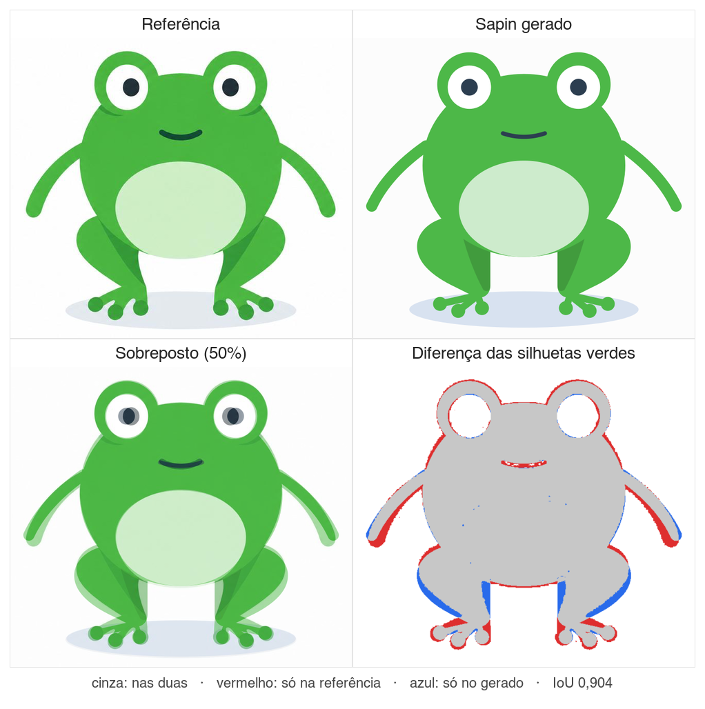

# 🧩 Task 142 — O Sapin como variacao do mascote

- Status: in-progress
- Type: feat
- Assignee: sidartaveloso

## Description
O Sapin e o sapinho da marca para SAP (referencia: `TASKS/assets/sapin/sapin-mascote.png`): olhos saltados em calombos no topo da cabeca, barriga clara, bracos finos e pernas agachadas com dedos em bolinha. Ele entra como variacao do mascote, e nao como componente novo: `<Taskin variant="sapin">`, com os mesmos humores, comportamentos, movimentos e stories do Taskin. Cada peca que o `Taskin` monta (corpo, olhos, boca, bracos, efeitos) ganha a prop `variant` e desenha a sua variante; o que o Taskin desenha hoje nao muda. A paleta dos humores e a mesma do Taskin; so a cor de base muda, do azul `#1f7acb` para o verde `#4DB848`, nos quatro humores que a usam (`neutral`, `smirk`, `annoyed`, `sarcastic`).

## Tasks
<!-- [x] feito · [ ] em aberto · [ ] ... — adiado: <razão> para o que se decidiu não fazer -->
- [x] `TASKIN_VARIANTS = ['taskin', 'sapin']` e o tipo `TaskinVariant` em `organisms/taskin/Taskin.variants.ts`, no molde de `Taskin.moods.ts`; o arquivo nao importa nada, e os atomos importam o tipo dele sem ciclo. Exportado pelo `index.ts` do organismo e do pacote. Testes: `Taskin.variants.spec.ts` — sem repeticao, comeca pelo `taskin` (o default), o tipo deriva da lista, e as 2 variantes x 17 humores desenham corpo, olhos e boca
- [x] Olhos: `EYE_GEOMETRY` em `TaskinEyes.types.ts` e a fonte das posicoes. Sapin com os centros em (121,71)/(199,71), esclera redonda sem contorno e pupila maior; fechado, desenha o traco da palpebra, que sem isso sumiria no verde. O rastreio le os centros da variante (o `Taskin` remonta os olhos pela `key` na troca). Testes em `TaskinEyes.spec.ts`
- [x] Boca: `MOUTH_OFFSET`/`mouthTransform` em `TaskinMouth.types.ts` — as mesmas expressoes, 21 unidades mais altas no Sapin. Bracos: ombros (90,113)/(230,113) e braco mais longo no Sapin, com os mesmos angulos, entao o rastreio de pose continua valendo. Testes em `TaskinMouth.spec.ts` e `TaskinArms.spec.ts`
- [x] Corpo: no Sapin, o `TaskinBody` desenha coxas, corpo, calombos dos olhos (nos centros de `EYE_GEOMETRY`), barriga e pes com tres dedos cada. As pernas moram no corpo porque as coxas sao parte da silhueta do sapo — e isso que dispensa um atomo novo. A barriga e branco translucido por cima da cor do corpo, e a canela e preto translucido, entao os dois acompanham qualquer cor de humor. `tapToes` bate os dedos. Testes em `TaskinBody.spec.ts`
- [x] Efeitos presos ao rosto andam com ele: lagrimas, Zzz e coracoes pelo `eyeShift` (quanto o olho andou do Taskin para a variante), vomito pela ancora da boca, e o balao de pensamento com base propria no Sapin (`BUBBLE_BASE`, mais alto e mais a direita), porque o de sempre cobria o olho direito. Os limites do quadro valem para as duas variantes. A nuvem de pum nao muda. Testes nos specs de cada efeito e em `thought-bubble-layout.spec.ts`
- [x] O organismo: prop `variant` (padrao `taskin`); `BASE_COLORS` supre a cor dos humores sem cor propria; o Sapin nao tem tentaculos e tem sombra mais larga. O sapo inteiro se move junto — olhos, boca e efeitos dentro de `#sapin-motion` —: pula no `dancing`, flutua no `in-love`, balanca no `tired`, treme no `cold`, arfa no `hot` e fica parado no `sleeping`. No ocioso, o piscar e o mesmo, e o "wiggle" dos tentaculos vira os dedos batendo. Nada se move com `animationsEnabled=false`. Testes em `Taskin.spec.ts`
- [x] Correcao junto: o `Taskin` passava `color` ao `TaskinArmWithPhone`, cuja prop e `armColor`, entao o braco da selfie saia sempre rosa `#FF6B9D`, nas duas variantes. Agora sai na cor do humor. Teste em `Taskin.spec.ts`
- [x] `TaskinWithShhh` e `TaskinWithFaceTracking` repassam o `variant`. Testes nos dois specs e uma story `Sapin` em cada
- [x] Stories: `Organisms/Taskin/Sapin` reaproveita as stories do Taskin uma a uma (`AllMoods`, `Default`, as 15 de humor, ocioso, sem animacao e as tres de rastreio dos olhos), com o `variant` vindo dos `args` do meta, e ganha `Variantes`, com os dois lado a lado em todos os humores. `Taskin.stories.ts` ganha o controle `variant`, e as renders proprias passam a repassa-lo. Body, Eyes, Mouth, Arms e os efeitos Tears, Vomit, Zzz, Hearts e ThoughtBubble ganham o controle e uma story `Sapin`
- [x] Docs: secao "Variants: Taskin and Sapin" em `packages/design-vue/README.md`
- [x] Changeset `.changeset/sapin-variacao-do-mascote.md` (minor no `@opentask/taskin-design-vue`, pela prop nova)
- [x] Verificacao: `pnpm --filter @opentask/taskin-design-vue typecheck`, `lint` e `build` verdes; specs 379/379 e stories como testes 278/278 no Chromium; `turbo run typecheck --filter=...@opentask/taskin-design-vue` com 17/17; testes do `@opentask/taskin-mascote` 21/21. No Storybook, o `Default` do Sapin conferido com a referencia, os 17 humores e os cinco movimentos amostrados pela Web Animations API. Evidencia visual, o Sapin desta task contra a referencia, na mesma escala (silhueta verde com IoU 0,904; a task-146 depois refinou o desenho): 
- [ ] O `TaskinBody` do Taskin nao tem as props `shiver`, `pant` e `dance` que o `Taskin` passa, entao frio, calor e danca nao mexem o corpo do polvo — adiado: fora do pedido; o Sapin tem esses movimentos pelo grupo de movimento. Resolvido na task-145, que da ao polvo o mesmo grupo de movimento
- [ ] A lagrima (`#4A90E2`) e da mesma cor do corpo no humor `crying`, e some — adiado: ja era assim no Taskin, e a paleta e a mesma nas duas variantes
- [ ] O app do mascote (PWA), a landing, `mascot.variant` no `.taskin.json`, os icones e o resto da marca Sapin (logo e tema verde das telas em `TASKS/assets/sapin/`) — adiado: esta entrega e so o design-vue

## Notes

### O Chromium dos testes
O Playwright do projeto (1.57) quer o `chromium_headless_shell-1200`, que faltava no cache desta maquina. A primeira rodada usou uma config local, fora do repositorio, apontando para um headless shell mais novo; depois do `pnpm exec playwright install chromium`, o `pnpm --filter @opentask/taskin-design-vue test` passou pelo caminho normal, com os mesmos 379 specs e 278 stories.
