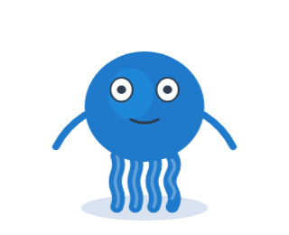
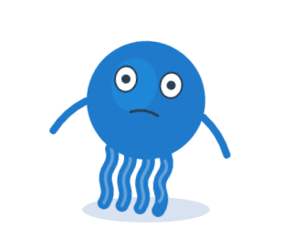
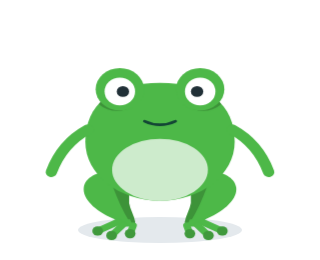
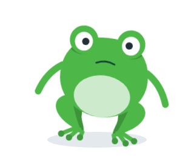

# 🧩 Task 148 — O mascote faz acoes de uma vez so, e as primeiras sao o sim e o nao

- Status: in-progress
- Type: feat
- Assignee: sidartaveloso
- Group: movimentos-lote-1
- Priority: 14010
- Difficulty: 4

## Description
O mascote tem humores, que sao estados em laco, e o ocioso; nao ha como pedir "acene uma vez e volte ao que estava" (o TaskinWithShhh troca de humor e volta ao neutral). Esta task cria a acao de uma vez so nos dois bichos: `play()`, o fim avisado, a volta ao humor e uma pose que vale durante a acao. Prova o caminho com as duas mais simples, o sim (`nod`) e o nao (`shake`), e passa a respeitar `prefers-reduced-motion`. As outras tasks de movimento sao dados nesta estrutura.

## Tasks
<!-- [x] feito · [ ] em aberto · [ ] ... — adiado: <razão> para o que se decidiu não fazer -->
- [x] `packages/design-vue/src/components/organisms/taskin/Taskin.actions.ts`, no molde de `Taskin.moods.ts` e `Taskin.variants.ts`: `TASKIN_ACTIONS = ['nod', 'shake'] as const` e o tipo `TaskinAction`, no proprio arquivo e sem importar nada; exportado no `index.ts` do organismo e em `packages/design-vue/src/index.ts` — prova: `Taskin.actions.spec.ts` › `TASKIN_ACTIONS` › `nao repete acao`; `export * from './Taskin.actions'` nos dois `index.ts`
- [x] Em `packages/design-vue/src/components/organisms/taskin/Taskin.ts`, a tabela `ACTIONS: Record<TaskinVariant, Partial<Record<TaskinAction, ActionConfig>>>` com `className`, `durationMs` e `pose?` (`leftArm`, `rightArm`: `ArmPosition`; `eyeState`, `lookDirection`, `mouthExpression`), e o CSS das acoes no `<style>` de cada variante, junto de `TASKIN_MOTION_CSS` e `SAPIN_MOTION_CSS`, com `animation-iteration-count: 1`. Acao que a variante nao tem resolve na hora com `false`: as exclusivas (lingua, tinta, malabarismo) dependem disso — prova: `ACTIONS` exportado de `Taskin.ts` (nomeado, para os testes); `%s: %s anima de verdade, uma vez so` confere `animationName` e `iterations === 1` pela Web Animations API; `acao que a variante nao tem resolve false na hora, sem mexer no grupo`
- [x] `play(action): Promise<boolean>` exposto pelo componente (`expose`), e os eventos `action-start` (a acao) e `action-end` (`{ action, completed }`). Enquanto roda, a classe da acao entra no `#<variante>-motion` no lugar da classe do humor, e a `pose` vale; no fim, o humor volta sozinho. O fim e por timer de `durationMs`, e nao por `animationend`. Uma acao nova no meio de outra substitui a atual, cuja promessa resolve `false`. Com `animationsEnabled=false` nao ha classe, mas a promessa resolve no mesmo tempo — prova: `%s: a classe de %s entra no grupo, sai no fim e a do humor volta` (4 casos, humor `dancing`), `emite action-start e action-end`, `uma acao nova no meio de outra substitui a atual, que resolve false`, `com as animacoes desligadas nao ha classe, e a promessa resolve no mesmo tempo`. A mais: desmontar no meio resolve `false` (`desmontar no meio resolve false`)
- [x] A precedencia: prop explicita do consumidor (`eyeState`, `mouthExpression`, `eyeLookDirection`) > `pose` da acao > humor. Os bracos da `pose` vao ao `TaskinArms` como `leftArmPosition`/`rightArmPosition`; no `taking-selfie` os bracos sao os do celular e a pose de braco nao vale — prova: `%s: a pose troca a boca durante a acao`, `a prop explicita do consumidor ganha da pose`; os bracos no `render` de `Taskin.ts` (so no ramo `TaskinArms`). Nenhuma acao desta task tem pose de braco, entao os bracos ainda nao tem teste proprio: a primeira que tiver (task-150/151) o cobre
- [x] `nod`: o bicho inteiro inclina para a frente e volta, duas vezes (~0,7s), com `pose.mouthExpression = 'smile'`. `shake`: gira de um lado para o outro, tres vezes (~0,7s), com `'frown'`. Eixos como os de `.taskin-motion` e `.sapin-motion`; prefixo `taskin-<variante>-` nos keyframes — prova: as classes `.taskin-nod`/`.taskin-shake`/`.sapin-nod`/`.sapin-shake` e os keyframes `taskin-taskin-nod` etc. em `TASKIN_MOTION_CSS`/`SAPIN_MOTION_CSS`; o eixo vem da classe `*-motion`, que continua no grupo. No 2D de frente, a inclinacao e um mergulho (desce e achata) e volta, duas vezes; o nao gira ±8° (Taskin) e ±6° (Sapin)
- [x] `@media (prefers-reduced-motion: reduce)` desliga as animacoes do grupo de movimento, humores e acoes, pelo CSS; o timer das acoes continua — prova: `%s: prefers-reduced-motion desliga o grupo de movimento pelo CSS` (le a regra pelo CSSOM: `animation-name: none !important` em `.<variante>-motion`); o timer nao depende do CSS (`com as animacoes desligadas...` prova o mesmo caminho)
- [x] Story `Actions` em `Taskin.stories.ts`: um botao por item de `TASKIN_ACTIONS` chamando `play()` pela ref, e o nome da ultima acao terminada ao lado (`data-testid="ultima-acao"`). O `Sapin.stories.ts` a reaproveita com `{ ...TaskinStories.Actions }` — prova: as stories rodam no `pnpm --filter @opentask/taskin-design-vue test` (projeto storybook, verde)
- [x] Testes em `packages/design-vue/src/components/organisms/taskin/Taskin.actions.spec.ts`, com fake timers — 20 testes, verdes: `pnpm --filter @opentask/taskin-design-vue exec vitest run src/components/organisms/taskin/Taskin.actions.spec.ts`
- [x] Evidencia visual em `TASKS/assets/task-148/`: `nod` e `shake`, cada uma no quadro de maior inclinacao (175 ms, 25% dos 700 ms) — taskin e sapin, pela receita de Notes (spec temporario apagado):
  - 
  - 
  - 
  - 
- [x] Changeset `.changeset/mascote-acoes-de-uma-vez.md`, minor no `@opentask/taskin-design-vue`

## Notes
### Contexto da rodada
Ler, e so isto:
- `packages/design-vue/src/components/organisms/taskin/Taskin.ts` — o `MOTIONS` por variante (e as constantes `*_MOTION_BY_MOOD` e `*_MOTION_CSS` logo acima) e o `render`: o grupo `#<variante>-motion` recebe a classe do humor, e o `<style>` vai no SVG
- `packages/design-vue/src/components/organisms/taskin/Taskin.moods.ts` e `packages/design-vue/src/components/organisms/taskin/Taskin.variants.ts` — o molde da lista e do tipo
- `packages/design-vue/src/components/organisms/taskin/Taskin.spec.ts` — o `mountTaskin` e o estilo dos testes (portugues, sem acento)
- `packages/design-vue/src/components/organisms/taskin/Taskin.stories.ts` (o meta e a `AllMoods`) e `packages/design-vue/src/components/organisms/taskin/Sapin.stories.ts` (como reaproveita as stories do Taskin)
- `packages/design-vue/src/components/atoms/taskin-arms/TaskinArms.types.ts` — `ArmPosition` e `armPosition(ombro, antebraco)`
Nao precisa ler: os outros atomos, os efeitos e os wrappers.

Esboco:
```ts
// Taskin.ts
interface ActionConfig {
  className: string; // entra no #<variante>-motion enquanto a acao roda
  durationMs: number; // o fim, por timer
  pose?: { leftArm?: ArmPosition; rightArm?: ArmPosition; eyeState?: EyeState; lookDirection?: LookDirection; mouthExpression?: MouthExpression };
}
// exposto: play(action: TaskinAction): Promise<boolean> — true terminou; false interrompida, ou a variante nao tem a acao
// emits: 'action-start' (action), 'action-end' ({ action, completed })
```

Como testar movimento sem esperar o relogio: congele a animacao pela Web Animations API (`el.getAnimations()[0].currentTime = t`) e confira `getComputedStyle(el).transform` ou `getBoundingClientRect()`. Aba oculta nao anda o relogio das animacoes; os testes nao devem depender dele.

### Evidencia visual
A task e de componente visual: a evidencia e imagem, e nao so contagem de teste. O agente nao ve o desenho, mas tira o screenshot no Chromium do container, por um spec temporario em `packages/design-vue/src/components/organisms/taskin/` (apague-o antes do commit; fica so a imagem):
```ts
import { mount } from '@vue/test-utils';
import { it } from 'vitest';
import { page } from 'vitest/browser';
import { nextTick } from 'vue';
import Taskin from './Taskin';

it('evidencia visual', async () => {
  for (const variant of ['taskin', 'sapin'] as const) {
    const wrapper = mount(Taskin, { attachTo: document.body, props: { variant, size: 320, idleAnimation: false } });
    const vm = wrapper.vm as unknown as { play: (a: string) => Promise<boolean> };
    void vm.play('<acao>');
    await nextTick();
    // congele no quadro que mostra o movimento
    const [animacao] = wrapper.find(`#${variant}-motion`).element.getAnimations();
    animacao?.pause();
    if (animacao) animacao.currentTime = <ms>;
    // relativo ao spec: seis niveis acima fica a raiz do repositorio (o Vite recusa caminho fora dele)
    await page.screenshot({ path: `../../../../../../TASKS/assets/task-148/${variant}-<nome>.png`, element: wrapper.element as HTMLElement });
    wrapper.unmount();
  }
});
```
Rode so ele (`pnpm --filter @opentask/taskin-design-vue exec vitest run src/components/organisms/taskin/<spec-temporario>.spec.ts`), confira que as imagens existem e registre-as no checklist. Receita provada na task-147 (o screenshot da task-146 saiu assim).

### Verificacao
```bash
pnpm --filter @opentask/taskin-design-vue typecheck
pnpm --filter @opentask/taskin-design-vue lint
pnpm --filter @opentask/taskin-design-vue test
```
O `test` roda os specs e as stories no Chromium; na imagem do sandcastle, depende da task-147.

### Onde executar
Sandcastle, lote 1: `SANDCASTLE_GROUP=movimentos-lote-1 SANDCASTLE_MODEL=claude-opus-5-5 npx tsx .sandcastle/main.ts`. Maquina: o `sidarta-desktop` da tailnet (Manjaro, i5-12600K com 16 threads, 31 GB, Docker nativo amd64, onde ja existe a imagem `sandcastle:taskin` e o `.sandcastle/.env`), no clone `~/repositorios/sidartaveloso/taskin`, depois de trazer a branch do Mac. Sem camada de VM e isolado das sessoes interativas do Mac. Ele divide a maquina com os containers do geohub e do mapgrid (sobravam 8,6 GB de RAM e 30 GB de disco na sondagem de 29/09): rode um lote por vez. Reserva: o Mac, pelo perfil Colima `sandcastle`, so a partir de um clone dedicado sob `$HOME` (o `merge-to-head` mescla no HEAD e troca a branch do diretorio). A revisao visual e no Mac, depois do lote: o agente no container nao ve o desenho, so os testes. Opus: esta task define a API que as outras preenchem.
