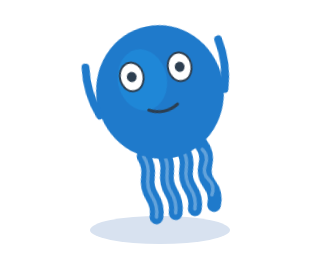
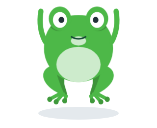

# 🧩 Task 149 — O mascote comemora: o polvo gira de bracos para o alto, o sapo pula e infla o papo

- Status: in-progress
- Type: feat
- Assignee: sidartaveloso
- Group: movimentos-lote-1
- Priority: 14020
- Difficulty: 3

## Description
A acao `celebrate`, para quando uma task e concluida: o Taskin ergue os bracos e da um giro curto; o Sapin pula alto e infla o papo. O papo e um elemento novo do corpo do Sapin, que a fala e a lingua reaproveitam depois.

## Tasks
<!-- [x] feito · [ ] em aberto · [ ] ... — adiado: <razão> para o que se decidiu não fazer -->
- [x] `celebrate` em `TASKIN_ACTIONS` e no `ACTIONS` das duas variantes, com ~1,2s — `Taskin.actions.ts` e `ACTIONS` em `Taskin.ts` (`durationMs: 1200`); prova: `celebrate > %s: dura cerca de 1,2s` e os `Taskin.play` parametrizados por `TASKIN_ACTIONS` (classe entra e sai, anima uma vez so) em `src/components/organisms/taskin/Taskin.actions.spec.ts`
- [x] Taskin: `pose` com os dois bracos para o alto (por exemplo `armPosition(-70, -100)` nos dois lados, ajustado para as maos passarem acima da cabeca) e o bicho inteiro num pulinho com meio giro de volta (`rotate` de ate 12deg, no eixo do `.taskin-motion`) — `celebratePose(-70, -100)` e `@keyframes taskin-taskin-celebrate` em `Taskin.ts`; prova: `celebrate > o Taskin gira no maximo 12 graus` e `celebrate > %s: a pose ergue os dois bracos acima dos ombros`. As maos passam dos ombros (punho ~48 unidades acima), mas nao por cima da cabeca: o braco do Taskin tem 50 unidades (`ARM_GEOMETRY` em `TaskinArms.vue`) e o ombro fica em y=120, entao a cabeca nao e alcancavel sem aumentar o braco, o que fica fora desta task
- [x] Sapin: agacha (escala 1,06 x 0,92), sobe ~24px com os bracos para o alto, e aterrissa amassando; no topo do pulo, o papo infla — `@keyframes taskin-sapin-celebrate` (agacha 20%, topo 45–55%, aterrissa 80%) e `taskin-sapin-throat` em `Taskin.ts`, pose `celebratePose(-60, -100)`; prova: `celebrate > o papo fica murcho fora da acao e infla no topo do pulo` (sobe -24px e papo em escala 1 aos 600ms)
- [x] O papo: elemento novo `#body-throat` no `TaskinBody` do Sapin, depois da barriga — elipse sob a boca (cx 160, cy 112, rx 16, ry 9), branca a 72% como a barriga, com `transform: scale(0)` em repouso (`transform-box: fill-box`, origem no centro). A classe da acao no grupo o infla: `.sapin-celebrate #body-throat`. Fica pronto para a fala (`speaking`) e para a lingua — em `TaskinBody.vue` (elipse + CSS scoped de repouso); `prefers-reduced-motion` tambem desliga a animacao do papo. Prova: `variante sapin > desenha o papo depois da barriga, sob a boca, murcho em repouso` em `TaskinBody.spec.ts`
- [x] Testes: a classe `*-celebrate` no grupo das duas variantes; o `#body-throat` so no Sapin, em escala 0 fora da acao e maior que 0 no meio dela (animacao congelada); a pose ergue os bracos acima dos ombros — `describe('celebrate')` em `src/components/organisms/taskin/Taskin.actions.spec.ts` e o teste novo em `TaskinBody.spec.ts`; `pnpm --filter @opentask/taskin-design-vue test` (284 testes, verde)
- [x] Evidencia visual em `TASKS/assets/task-149/`: `celebrate` no topo do pulo (no Sapin, com o papo inflado) — taskin e sapin. Cada imagem registrada aqui, no item que ela prova (``), pela receita de Notes
  - 
  - 
- [x] Changeset patch no `@opentask/taskin-design-vue` — `.changeset/mascote-comemora.md`

## Notes
### Contexto da rodada
Ler, e so isto:
- `packages/design-vue/src/components/organisms/taskin/Taskin.actions.ts` e, em `packages/design-vue/src/components/organisms/taskin/Taskin.ts`, o `ACTIONS` e o CSS das acoes (task-148)
- `packages/design-vue/src/components/atoms/taskin-body/TaskinBody.vue` — so o bloco do Sapin (`v-if="variant === 'sapin'"`) e as constantes `SAPIN_*`
- `packages/design-vue/src/components/atoms/taskin-body/TaskinBody.spec.ts` — o `describe('variante sapin')`
- `packages/design-vue/src/components/organisms/taskin/Taskin.actions.spec.ts` — onde entram os testes da acao
Nao precisa ler: os olhos, a boca, os efeitos e os wrappers.

A API das acoes (da task-148): `TASKIN_ACTIONS` em `packages/design-vue/src/components/organisms/taskin/Taskin.actions.ts`; a tabela `ACTIONS[variante][acao] = { className, durationMs, pose? }` e o CSS das acoes no `<style>` de cada variante, em `packages/design-vue/src/components/organisms/taskin/Taskin.ts`; `play(acao): Promise<boolean>` exposto. A `pose` (bracos, olhos, olhar, boca) vale so enquanto a acao roda; props explicitas do consumidor continuam mandando.

Como testar movimento sem esperar o relogio: congele a animacao pela Web Animations API (`el.getAnimations()[0].currentTime = t`) e confira `getComputedStyle(el).transform` ou `getBoundingClientRect()`. Aba oculta nao anda o relogio das animacoes; os testes nao devem depender dele.

### Evidencia visual
A task e de componente visual: a evidencia e imagem, e nao so contagem de teste. O agente nao ve o desenho, mas tira o screenshot no Chromium do container, por um spec temporario em `packages/design-vue/src/components/organisms/taskin/` (apague-o antes do commit; fica so a imagem):
```ts
import { mount } from '@vue/test-utils';
import { it } from 'vitest';
import { page } from 'vitest/browser';
import { nextTick } from 'vue';
import Taskin from './Taskin';

it('evidencia visual', async () => {
  for (const variant of ['taskin', 'sapin'] as const) {
    const wrapper = mount(Taskin, { attachTo: document.body, props: { variant, size: 320, idleAnimation: false } });
    const vm = wrapper.vm as unknown as { play: (a: string) => Promise<boolean> };
    void vm.play('<acao>');
    await nextTick();
    // congele no quadro que mostra o movimento
    const [animacao] = wrapper.find(`#${variant}-motion`).element.getAnimations();
    animacao?.pause();
    if (animacao) animacao.currentTime = <ms>;
    // relativo ao spec: seis niveis acima fica a raiz do repositorio (o Vite recusa caminho fora dele)
    await page.screenshot({ path: `../../../../../../TASKS/assets/task-149/${variant}-<nome>.png`, element: wrapper.element as HTMLElement });
    wrapper.unmount();
  }
});
```
Rode so ele (`pnpm --filter @opentask/taskin-design-vue exec vitest run src/components/organisms/taskin/<spec-temporario>.spec.ts`), confira que as imagens existem e registre-as no checklist. Receita provada na task-147 (o screenshot da task-146 saiu assim).

### Verificacao
```bash
pnpm --filter @opentask/taskin-design-vue typecheck
pnpm --filter @opentask/taskin-design-vue lint
pnpm --filter @opentask/taskin-design-vue test
```
O `test` roda os specs e as stories no Chromium; na imagem do sandcastle, depende da task-147.

### Onde executar
Sandcastle, lote 1: `SANDCASTLE_GROUP=movimentos-lote-1 SANDCASTLE_MODEL=claude-opus-5-5 npx tsx .sandcastle/main.ts`. Maquina: o `sidarta-desktop` da tailnet (Manjaro, i5-12600K com 16 threads, 31 GB, Docker nativo amd64, onde ja existe a imagem `sandcastle:taskin` e o `.sandcastle/.env`), no clone `~/repositorios/sidartaveloso/taskin`, depois de trazer a branch do Mac. Sem camada de VM e isolado das sessoes interativas do Mac. Ele divide a maquina com os containers do geohub e do mapgrid (sobravam 8,6 GB de RAM e 30 GB de disco na sondagem de 29/09): rode um lote por vez. Reserva: o Mac, pelo perfil Colima `sandcastle`, so a partir de um clone dedicado sob `$HOME` (o `merge-to-head` mescla no HEAD e troca a branch do diretorio). A revisao visual e no Mac, depois do lote: o agente no container nao ve o desenho, so os testes.
