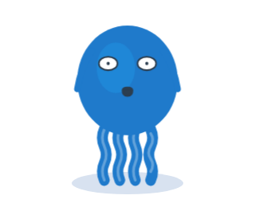
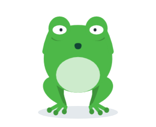

# 🧩 Task 155 — O mascote acorda: boceja e se espreguica

- Status: in-progress
- Type: feat
- Assignee: sidartaveloso
- Group: movimentos-lote-2
- Priority: 14140
- Difficulty: 3

## Description
A acao `wake`, para a volta depois de um tempo parado (o `sleeping` ja existe): olhos abrindo, um bocejo e uma espreguicada de bracos para o alto, nos dois bichos.

## Tasks
<!-- [x] feito · [ ] em aberto · [ ] ... — adiado: <razão> para o que se decidiu não fazer -->
- [x] `wake` em `TASKIN_ACTIONS` e no `ACTIONS` das duas variantes, com ~2s — prova: `Taskin.actions.spec.ts` › wake (durationMs 2000 nas duas variantes)
- [x] A acao em tres tempos no CSS, com a `pose` do meio: olhos `closed` -> `squint` (a pose fica em `squint`; o piscar do ocioso nao atrapalha), boca `o-shape` (o bocejo), bracos para o alto e para fora; o corpo alonga (escala 0,97 x 1,06) e volta — `WAKE` e `.taskin-wake`/`.sapin-wake` em `Taskin.ts` (bracos -100/-125, squint, o-shape, escala 0,97x1,06)
- [x] Se a pose precisar mudar no meio da acao, `pose` passa a aceitar uma lista de etapas com tempo (`{ atMs, ...pose }`) — so se precisar; o teste prova a troca — nao precisou: a pose fica estatica em `squint`; `pose` nao mudou
- [x] Testes: a boca em `o-shape` durante a acao e de volta ao humor no fim; o alongamento no meio (animacao congelada) — `wake: a boca boceja durante a acao e volta ao humor no fim` e `o corpo alonga no meio da acao`
- [x] Evidencia visual em `TASKS/assets/task-155/`: `wake` no meio do bocejo, de bracos para o alto — taskin e sapin. Cada imagem registrada aqui, no item que ela prova (``), pela receita de Notes —  
- [x] Changeset patch no `@opentask/taskin-design-vue` — `.changeset/o-mascote-acorda.md`

## Notes
### Contexto da rodada
Ler, e so isto:
- `packages/design-vue/src/components/organisms/taskin/Taskin.actions.ts` e, em `packages/design-vue/src/components/organisms/taskin/Taskin.ts`, o `ACTIONS`, a `pose` e o CSS das acoes (task-148)
- `packages/design-vue/src/components/atoms/taskin-arms/TaskinArms.vue` — `ARM_GEOMETRY`
- `packages/design-vue/src/components/organisms/taskin/Taskin.actions.spec.ts`
Nao precisa ler: o corpo, os efeitos e os wrappers.

A API das acoes (da task-148): `TASKIN_ACTIONS` em `packages/design-vue/src/components/organisms/taskin/Taskin.actions.ts`; a tabela `ACTIONS[variante][acao] = { className, durationMs, pose? }` e o CSS das acoes no `<style>` de cada variante, em `packages/design-vue/src/components/organisms/taskin/Taskin.ts`; `play(acao): Promise<boolean>` exposto. A `pose` (bracos, olhos, olhar, boca) vale so enquanto a acao roda; props explicitas do consumidor continuam mandando.

Como testar movimento sem esperar o relogio: congele a animacao pela Web Animations API (`el.getAnimations()[0].currentTime = t`) e confira `getComputedStyle(el).transform` ou `getBoundingClientRect()`. Aba oculta nao anda o relogio das animacoes; os testes nao devem depender dele.

### Evidencia visual
A task e de componente visual: a evidencia e imagem, e nao so contagem de teste. O agente nao ve o desenho, mas tira o screenshot no Chromium do container, por um spec temporario em `packages/design-vue/src/components/organisms/taskin/` (apague-o antes do commit; fica so a imagem):
```ts
import { mount } from '@vue/test-utils';
import { it } from 'vitest';
import { page } from 'vitest/browser';
import { nextTick } from 'vue';
import Taskin from './Taskin';

it('evidencia visual', async () => {
  for (const variant of ['taskin', 'sapin'] as const) {
    const wrapper = mount(Taskin, { attachTo: document.body, props: { variant, size: 320, idleAnimation: false } });
    const vm = wrapper.vm as unknown as { play: (a: string) => Promise<boolean> };
    void vm.play('<acao>');
    await nextTick();
    // congele no quadro que mostra o movimento
    const [animacao] = wrapper.find(`#${variant}-motion`).element.getAnimations();
    animacao?.pause();
    if (animacao) animacao.currentTime = <ms>;
    // relativo ao spec: seis niveis acima fica a raiz do repositorio (o Vite recusa caminho fora dele)
    await page.screenshot({ path: `../../../../../../TASKS/assets/task-155/${variant}-<nome>.png`, element: wrapper.element as HTMLElement });
    wrapper.unmount();
  }
});
```
Rode so ele (`pnpm --filter @opentask/taskin-design-vue exec vitest run src/components/organisms/taskin/<spec-temporario>.spec.ts`), confira que as imagens existem e registre-as no checklist. Receita provada na task-147 (o screenshot da task-146 saiu assim).

### Verificacao
```bash
pnpm --filter @opentask/taskin-design-vue typecheck
pnpm --filter @opentask/taskin-design-vue lint
pnpm --filter @opentask/taskin-design-vue test
```
O `test` roda os specs e as stories no Chromium; na imagem do sandcastle, depende da task-147.

### Onde executar
Sandcastle, lote 2: `SANDCASTLE_GROUP=movimentos-lote-2 SANDCASTLE_MODEL=claude-sonnet-5-5 npx tsx .sandcastle/main.ts`. Maquina: o `sidarta-desktop` da tailnet (Manjaro, i5-12600K com 16 threads, 31 GB, Docker nativo amd64, onde ja existe a imagem `sandcastle:taskin` e o `.sandcastle/.env`), no clone `~/repositorios/sidartaveloso/taskin`, depois de trazer a branch do Mac. Sem camada de VM e isolado das sessoes interativas do Mac. Ele divide a maquina com os containers do geohub e do mapgrid (sobravam 8,6 GB de RAM e 30 GB de disco na sondagem de 29/09): rode um lote por vez. Reserva: o Mac, pelo perfil Colima `sandcastle`, so a partir de um clone dedicado sob `$HOME` (o `merge-to-head` mescla no HEAD e troca a branch do diretorio). A revisao visual e no Mac, depois do lote: o agente no container nao ve o desenho, so os testes.
