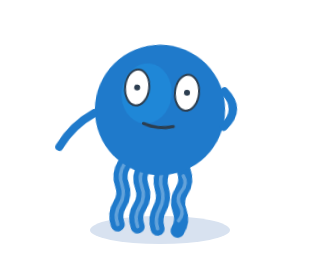
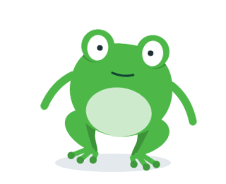

# 🧩 Task 156 — O mascote ouve quando o microfone esta ligado

- Status: done
- Type: feat
- Assignee: sidartaveloso
- Group: movimentos-lote-3
- Priority: 14210
- Difficulty: 2

## Description
Ouvir nao e acao de uma vez so: dura enquanto o microfone estiver ligado. A prop `listening`, nos dois bichos: o Taskin leva a mao para junto da cabeca e inclina; o Sapin arregala os olhos e inclina.

## Tasks
<!-- [x] feito · [ ] em aberto · [ ] ... — adiado: <razão> para o que se decidiu não fazer -->
- [x] Prop `listening?: boolean` no `Taskin` (e em `TaskinProps`), repassada pelo `TaskinWithShhh` e pelo `TaskinWithFaceTracking`
  - Prova: prop em `packages/design-vue/src/components/organisms/taskin/Taskin.ts` (`listening`), tipo em `Taskin.types.ts`, `:listening` nos dois wrappers; testes `repassa listening ao mascote` em `TaskinWithShhh.spec.ts` e `TaskinWithFaceTracking.spec.ts`.
- [x] Enquanto `true`: uma pose que perde para a acao que estiver rodando e ganha do humor — Taskin com o braco direito dobrado, a mao junto da cabeca; os dois com `eyeState: 'wide'` — e uma classe em laco no grupo (`*-listening`: inclina 6deg e respira devagar)
  - Prova: `LISTENING` e as classes `taskin-listening`/`sapin-listening` em `packages/design-vue/src/components/organisms/taskin/Taskin.ts` (a pose so vale sem acao rodando; props explicitas ainda mandam). Testes `listening > %s: ouvindo, a classe em laco ganha do humor e os olhos arregalam` e `taskin: o braco direito dobra e a mao sobe para junto da cabeca` em `Taskin.actions.spec.ts`.
- [x] Com `animationsEnabled=false`, fica so a pose, sem laco
  - Prova: teste `listening > %s: sem animacao fica so a pose, sem laco`.
- [x] Testes: a pose e a classe so com `listening`; uma acao por cima ganha, e no fim a escuta volta; os wrappers repassam
  - Prova: `describe('listening')` em `Taskin.actions.spec.ts` (inclui `uma acao por cima ganha, e no fim a escuta volta` e `desligar a escuta devolve o humor`); `pnpm --filter @opentask/taskin-design-vue test` passa. Nota: os wrappers mandam `eyeState` explicito (do rastreio facial), que ganha dos olhos arregalados da escuta — o contrato de sempre das props explicitas.
- [x] Evidencia visual em `TASKS/assets/task-156/`: `listening` ligado — taskin e sapin. Cada imagem registrada aqui, no item que ela prova (``), pela receita de Notes
  - 
  - 
- [x] Changeset patch no `@opentask/taskin-design-vue`
  - Prova: `.changeset/o-mascote-ouve.md`.

## Notes
### Contexto da rodada
Ler, e so isto:
- `packages/design-vue/src/components/organisms/taskin/Taskin.ts` — as props, a precedencia da `pose` (task-148) e o grupo de movimento no `render`
- `packages/design-vue/src/components/organisms/taskin/Taskin.types.ts` — `TaskinProps`
- `packages/design-vue/src/components/organisms/taskin/TaskinWithShhh.vue` e `packages/design-vue/src/components/organisms/taskin/TaskinWithFaceTracking.vue` — so o `<Taskin ...>` e o `Props`
- `packages/design-vue/src/components/organisms/taskin/Taskin.actions.spec.ts`
Nao precisa ler: os atomos, os efeitos e as stories dos wrappers.

A API das acoes (da task-148): `TASKIN_ACTIONS` em `packages/design-vue/src/components/organisms/taskin/Taskin.actions.ts`; a tabela `ACTIONS[variante][acao] = { className, durationMs, pose? }` e o CSS das acoes no `<style>` de cada variante, em `packages/design-vue/src/components/organisms/taskin/Taskin.ts`; `play(acao): Promise<boolean>` exposto. A `pose` (bracos, olhos, olhar, boca) vale so enquanto a acao roda; props explicitas do consumidor continuam mandando.

### Evidencia visual
A task e de componente visual: a evidencia e imagem, e nao so contagem de teste. O agente nao ve o desenho, mas tira o screenshot no Chromium do container, por um spec temporario em `packages/design-vue/src/components/organisms/taskin/` (apague-o antes do commit; fica so a imagem):
```ts
import { mount } from '@vue/test-utils';
import { it } from 'vitest';
import { page } from 'vitest/browser';
import { nextTick } from 'vue';
import Taskin from './Taskin';

it('evidencia visual', async () => {
  for (const variant of ['taskin', 'sapin'] as const) {
    const wrapper = mount(Taskin, { attachTo: document.body, props: { variant, size: 320, idleAnimation: false } });
    // a prop ja entra no mount (ex.: listening: true)
    await nextTick();
    // relativo ao spec: seis niveis acima fica a raiz do repositorio (o Vite recusa caminho fora dele)
    await page.screenshot({ path: `../../../../../../TASKS/assets/task-156/${variant}-<nome>.png`, element: wrapper.element as HTMLElement });
    wrapper.unmount();
  }
});
```
Rode so ele (`pnpm --filter @opentask/taskin-design-vue exec vitest run src/components/organisms/taskin/<spec-temporario>.spec.ts`), confira que as imagens existem e registre-as no checklist. Receita provada na task-147 (o screenshot da task-146 saiu assim).

### Verificacao
```bash
pnpm --filter @opentask/taskin-design-vue typecheck
pnpm --filter @opentask/taskin-design-vue lint
pnpm --filter @opentask/taskin-design-vue test
```
O `test` roda os specs e as stories no Chromium; na imagem do sandcastle, depende da task-147.

### Onde executar
Sandcastle, lote 3: `SANDCASTLE_GROUP=movimentos-lote-3 SANDCASTLE_MODEL=claude-opus-5-5 npx tsx .sandcastle/main.ts`. Maquina: o `sidarta-desktop` da tailnet (Manjaro, i5-12600K com 16 threads, 31 GB, Docker nativo amd64, onde ja existe a imagem `sandcastle:taskin` e o `.sandcastle/.env`), no clone `~/repositorios/sidartaveloso/taskin`, depois de trazer a branch do Mac. Sem camada de VM e isolado das sessoes interativas do Mac. Ele divide a maquina com os containers do geohub e do mapgrid (sobravam 8,6 GB de RAM e 30 GB de disco na sondagem de 29/09): rode um lote por vez. Reserva: o Mac, pelo perfil Colima `sandcastle`, so a partir de um clone dedicado sob `$HOME` (o `merge-to-head` mescla no HEAD e troca a branch do diretorio). A revisao visual e no Mac, depois do lote: o agente no container nao ve o desenho, so os testes.
