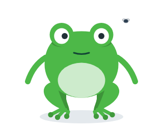
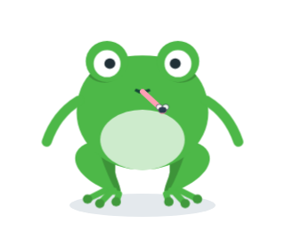
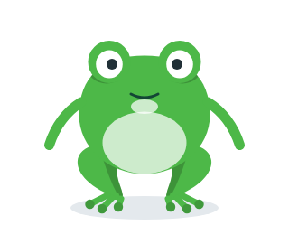

# 🧩 Task 158 — O Sapin pega a mosca com a lingua

- Status: done
- Type: feat
- Assignee: sidartaveloso
- Group: movimentos-lote-3
- Priority: 14230
- Difficulty: 4

## Description
A assinatura do Sapin: bug e mosca, e o sapo come o bug. A acao `catch-fly`, so do Sapin, para quando uma task do tipo `fix` e concluida: uma mosca voa perto da cabeca, os olhos a seguem, a lingua sai, pega e volta, e o papo engole. No Taskin, a acao nao existe e `play` resolve `false`.

## Tasks
<!-- [x] feito · [ ] em aberto · [ ] ... — adiado: <razão> para o que se decidiu não fazer -->
- [x] `catch-fly` em `TASKIN_ACTIONS` e so no `ACTIONS` do Sapin, com ~1,6s — `Taskin.actions.ts`; `ACTIONS.sapin['catch-fly']` (1600 ms) em `Taskin.ts`. Teste `catch-fly > so o Sapin tem a acao, com cerca de 1,6s`
- [x] Efeito novo `packages/design-vue/src/components/molecules/taskin-effect-fly/` (no molde do `TaskinEffectZzz`, com spec, stories, types e index; exportado em `molecules/index.ts` e `src/index.ts`): corpinho `#2C3E50` e duas asas `.fly-wing` que batem (`taskin-fly-flap`, 0,08s); arco a direita da cabeca, parada em `FLY_STOP` (182, 124) aos 60%, levada pela lingua ate a boca e some aos 80% (`taskin-fly-catch`). Testes `TaskinEffectFly.spec.ts` e `catch-fly > a mosca voa, some depois do bote e bate as asas`
- [x] A lingua: `#sapin-tongue` no `render` do `Taskin.ts`, com `mouthTransform(variant)`; traco `#FF9EB5` de 6 com ponta redonda, da boca (160, 124 no desenho da boca do Taskin) ate a mosca; `#sapin-tongue-reach` escala de 0 a 1 e volta (`taskin-sapin-tongue`, 60% → 66% → 78%) em volta da raiz. Teste `catch-fly > a lingua sai da boca do Sapin ate a mosca e volta`
- [x] Olhos seguindo a mosca: `ActionConfig` ganhou `steps` (a pose muda no meio, por timer, limpo no `endAction`); `CATCH_FLY` olha `right` e aos 960 ms passa a `center` com a boca `open`, e aos 1280 ms sorri. O gole: `.sapin-catch-fly #body-throat` (`taskin-sapin-gulp`, infla de 80% a 88% e murcha). Testes `os olhos seguem a mosca...` e `no fim o papo infla uma vez: o gole`
- [x] Testes: todos no `describe('catch-fly')` de `Taskin.actions.spec.ts` (animacao congelada pela Web Animations API); os testes genericos de `Taskin.play` passaram a iterar so as acoes que cada variante tem. `pnpm --filter @opentask/taskin-design-vue test` — 565 specs + 289 stories verdes
- [x] Evidencia visual em `TASKS/assets/task-158/`, so sapin, por spec temporario (ja apagado) com as animacoes congeladas:
  - a mosca voando (450 ms): 
  - a lingua no bote (1056 ms): 
  - o gole (1410 ms): 
  Nos quadros com passos de pose, o olhar e a boca vieram das props explicitas (`eyeLookDirection`, `mouthExpression`), porque os passos correm por timer e o spec nao espera o relogio.
- [x] Changeset minor no `@opentask/taskin-design-vue` — `.changeset/sapin-pega-a-mosca.md`

## Notes
### Contexto da rodada
Ler, e so isto:
- `packages/design-vue/src/components/organisms/taskin/Taskin.actions.ts` e, em `packages/design-vue/src/components/organisms/taskin/Taskin.ts`, o `ACTIONS`, o CSS das acoes e o bloco dos efeitos no `render` (task-148)
- `packages/design-vue/src/components/molecules/taskin-effect-zzz/` inteiro — o molde de efeito
- `packages/design-vue/src/components/atoms/taskin-mouth/TaskinMouth.types.ts` — `MOUTH_OFFSET` e `mouthTransform`; `TaskinMouth.vue` so o `#mouth-tongue` do ofegante, como referencia de lingua
- `packages/design-vue/src/components/atoms/taskin-body/TaskinBody.vue` — o `#body-throat`
- `TASKS/assets/sapin/sapin-mascote.png` — o desenho de referencia
Nao precisa ler: os bracos, os olhos por dentro e os wrappers.

A API das acoes (da task-148): `TASKIN_ACTIONS` em `packages/design-vue/src/components/organisms/taskin/Taskin.actions.ts`; a tabela `ACTIONS[variante][acao] = { className, durationMs, pose? }` e o CSS das acoes no `<style>` de cada variante, em `packages/design-vue/src/components/organisms/taskin/Taskin.ts`; `play(acao): Promise<boolean>` exposto. A `pose` (bracos, olhos, olhar, boca) vale so enquanto a acao roda; props explicitas do consumidor continuam mandando.

Como testar movimento sem esperar o relogio: congele a animacao pela Web Animations API (`el.getAnimations()[0].currentTime = t`) e confira `getComputedStyle(el).transform` ou `getBoundingClientRect()`. Aba oculta nao anda o relogio das animacoes; os testes nao devem depender dele.

### Evidencia visual
A task e de componente visual: a evidencia e imagem, e nao so contagem de teste. O agente nao ve o desenho, mas tira o screenshot no Chromium do container, por um spec temporario em `packages/design-vue/src/components/organisms/taskin/` (apague-o antes do commit; fica so a imagem):
```ts
import { mount } from '@vue/test-utils';
import { it } from 'vitest';
import { page } from 'vitest/browser';
import { nextTick } from 'vue';
import Taskin from './Taskin';

it('evidencia visual', async () => {
  for (const variant of ['sapin'] as const) {
    const wrapper = mount(Taskin, { attachTo: document.body, props: { variant, size: 320, idleAnimation: false } });
    const vm = wrapper.vm as unknown as { play: (a: string) => Promise<boolean> };
    void vm.play('<acao>');
    await nextTick();
    // congele no quadro que mostra o movimento
    const [animacao] = wrapper.find(`#${variant}-motion`).element.getAnimations();
    animacao?.pause();
    if (animacao) animacao.currentTime = <ms>;
    // relativo ao spec: seis niveis acima fica a raiz do repositorio (o Vite recusa caminho fora dele)
    await page.screenshot({ path: `../../../../../../TASKS/assets/task-158/${variant}-<nome>.png`, element: wrapper.element as HTMLElement });
    wrapper.unmount();
  }
});
```
Rode so ele (`pnpm --filter @opentask/taskin-design-vue exec vitest run src/components/organisms/taskin/<spec-temporario>.spec.ts`), confira que as imagens existem e registre-as no checklist. Receita provada na task-147 (o screenshot da task-146 saiu assim).

### Verificacao
```bash
pnpm --filter @opentask/taskin-design-vue typecheck
pnpm --filter @opentask/taskin-design-vue lint
pnpm --filter @opentask/taskin-design-vue test
```
O `test` roda os specs e as stories no Chromium; na imagem do sandcastle, depende da task-147.

### Onde executar
Sandcastle, lote 3: `SANDCASTLE_GROUP=movimentos-lote-3 SANDCASTLE_MODEL=claude-opus-5-5 npx tsx .sandcastle/main.ts`. Maquina: o `sidarta-desktop` da tailnet (Manjaro, i5-12600K com 16 threads, 31 GB, Docker nativo amd64, onde ja existe a imagem `sandcastle:taskin` e o `.sandcastle/.env`), no clone `~/repositorios/sidartaveloso/taskin`, depois de trazer a branch do Mac. Sem camada de VM e isolado das sessoes interativas do Mac. Ele divide a maquina com os containers do geohub e do mapgrid (sobravam 8,6 GB de RAM e 30 GB de disco na sondagem de 29/09): rode um lote por vez. Reserva: o Mac, pelo perfil Colima `sandcastle`, so a partir de um clone dedicado sob `$HOME` (o `merge-to-head` mescla no HEAD e troca a branch do diretorio). A revisao visual e no Mac, depois do lote: o agente no container nao ve o desenho, so os testes. Opus: arte nova e tempos casados. Depende da task-149. A que mais pede revisao visual no Mac.
