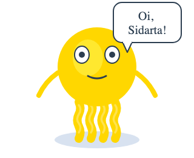
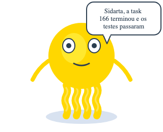
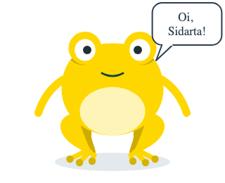
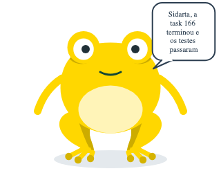
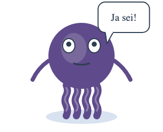

# 🧩 Task 166 — O mascote fala em balao: TaskinEffectSpeechBubble e a prop speechText

- Status: done
- Type: feat
- Assignee: sidartaveloso
- Group: movimentos-do-mascote
- Priority: 14310
- Difficulty: 3

## Description
O mascote so tem balao de pensamento; quem quer que ele fale com a pessoa (o chat, o app do mascote, a landing) precisa desenhar o balao por fora, e o texto fica descolado do desenho. Um balao de fala nativo, com rabicho saindo da boca, dimensionado pela frase como o de pensamento, ligado pela prop speechText do Taskin, no Taskin e no Sapin.

## Tasks
<!-- [x] feito · [ ] em aberto · [ ] ... — adiado: <razão> para o que se decidiu não fazer -->
- [x] Molecula `TaskinEffectSpeechBubble` em `packages/design-vue/src/components/molecules/taskin-effect-speech-bubble/`: retangulo arredondado com rabicho, texto quebrado em `<tspan>` pelo mesmo layout do balao de pensamento, sem a pulsacao; com `animationsEnabled`, so a entrada curta (`speech-pop`). O `layoutThoughtBubble` virou um `layoutBubble(texto, variant, options)` parametrizado (`base`, `leftLimit`, `maxFontSize`, `hugTop`), e o de pensamento e o de fala sao duas chamadas dele — `thought-bubble-layout.ts`, `speech-bubble-layout.ts`
- [x] O rabicho nao vai ate a boca: entre a caixa e a boca mora o olho direito (Taskin em `y` 72–108; no Sapin, o calombo em cima da cabeca). A caixa cola no topo e para antes do olho (fonte maxima 20, duas linhas acabam em `y` 70), e a ponta encosta no rosto a direita do olho (`SPEECH_TIP`), como as bolinhas do pensamento param na beira da cabeca. No Sapin a caixa so comeca a direita do calombo (`leftLimit` 216): e mais estreita e cede a fonte mais cedo. Prova: `speech-bubble-layout.spec.ts` (a caixa acima do olho do Taskin, a direita do calombo do Sapin, em frases curta, media e longa)
- [x] Prop `speechText?: string` no `Taskin` e em `TaskinProps`: com texto, o balao de fala aparece e o de pensamento sai de cena; vazio ou `undefined`, nada muda. Nas duas variantes — `Taskin.ts`, `Taskin.types.ts`. Prova: `Taskin.spec.ts` › speechText (sem texto nao ha balao; com texto diz a frase; esconde o de pensamento; o de pensamento volta quando a fala acaba)
- [x] Stories: `Molecules/Taskin/Effects/SpeechBubble` (Short, LongPhrase, NoAnimation, Sapin; o ponto cinza marca a boca) e `Organisms/Taskin/Taskin` › `Speaking`, com `speechText` e `speaking` ligados
- [x] Testes: `TaskinEffectSpeechBubble.spec.ts` (caixa, rabicho, texto, quebra sem perder texto, caixa cresce, pop so com animacao), `speech-bubble-layout.spec.ts`, `Taskin.spec.ts` › speechText. `pnpm --filter @opentask/taskin-design-vue test`: 651 + 299 passando
- [x] Evidencia visual em `TASKS/assets/task-166/` (humor `happy`, `speaking` ligado, animacoes congeladas):
  -  
  -  
  - 
- [x] Changeset minor no `@opentask/taskin-design-vue` — `.changeset/o-mascote-fala-em-balao.md`

## Notes
Nasce do experimento de 03/10/2026: o Claude passou a conversar pelo Taskin dentro do chat (componente Vue montado via esm.sh a partir do npm), e o balao de fala teve de ser HTML por fora, porque o mascote so sabe pensar. Esta task traz o balao para dentro do desenho. Irma da task-167 (o roteiro).

### Contexto
- `packages/design-vue/src/components/molecules/taskin-effect-thought-bubble/` (molecula, `thought-bubble-layout.ts`, story e spec): o modelo
- `packages/design-vue/src/components/organisms/taskin/Taskin.ts`: props `showThoughtBubble`/`thoughtBubbleText`, o `config` computado e a lista de efeitos no `render`
- `packages/design-vue/src/components/atoms/taskin-mouth/TaskinMouth.types.ts`: `MOUTH_OFFSET`, onde a boca esta em cada variante

### Verificacao
```bash
pnpm --filter @opentask/taskin-design-vue typecheck
pnpm --filter @opentask/taskin-design-vue lint
pnpm --filter @opentask/taskin-design-vue test
```
