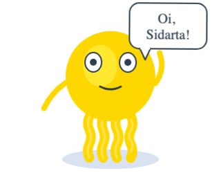
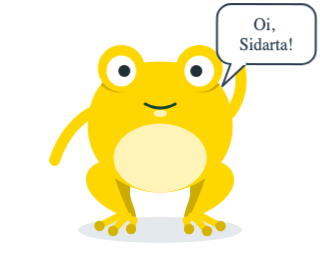

# 🧩 Task 167 — Roteiro do mascote: useTaskinScript encadeia humor, acao e fala

- Status: done
- Type: feat
- Assignee: sidartaveloso
- Group: movimentos-do-mascote
- Priority: 14320
- Difficulty: 3

## Description
Para conversar, o mascote precisa encadear passos: muda o humor, faz uma acao, diz uma frase e segura um tempo antes do proximo. Hoje isso fica a cargo de cada consumidor, com setTimeout solto. Um composable useTaskinScript devolve as props reativas (mood, speechText, speaking) para ligar no Taskin e um run(steps) que toca os passos em ordem, esperando o fim de cada acao pelo play() e dimensionando a pausa pela frase.

## Tasks
<!-- [x] feito · [ ] em aberto · [ ] ... — adiado: <razão> para o que se decidiu não fazer -->
- [x] `useTaskinScript(taskin, { initialMood })` em `packages/design-vue/src/composables/use-taskin-script/`: recebe a ref do `Taskin` (um `TaskinPlayer`, quem tem `play`) e devolve `mood`, `speechText`, `speaking`, `running`, `run(steps)` e `stop()`
- [x] `TaskinScriptStep { mood?, action?, say?, holdMs? }`: `run` aplica o humor, liga `speaking` e o `speechText` enquanto o passo durar, toca a acao pelo `play()` e espera o fim dela, e segura a pausa (`stepHold`: `holdMs` manda; pela frase, 55 ms por caractere entre 1,2 s e 6 s; acao sozinha nao segura; passo vazio, 800 ms). `run` resolve `true` no fim e `false` se `stop()` ou outro `run` o interrompe; o que interrompe limpa a fala e deixa o humor onde estava
- [x] `useTaskinScript`, `stepHold`, `scriptDuration(variant, steps)` (a soma das acoes, pela variante, e das pausas) e os tipos nos exports do pacote — `composables/index.ts`
- [x] Story `Organisms/Taskin/Taskin` › `Script`: um botao toca um roteiro de quatro passos (acena e cumprimenta, pensa, comemora, ironiza), e outro para. Conferida no Storybook: os tres primeiros quadros saem na ordem, com o balao de cada passo
- [x] Testes com timers falsos em `use-taskin-script.spec.ts`: humor e fala aplicados e limpos no fim do passo; a espera pelo `play` (a pausa inteira passa e o passo nao acaba antes da acao); a ordem dos passos; `stop` e o `run` seguinte interrompem (`false`); interrompido no meio da acao nao toca a seguinte; sem `Taskin` montado o gesto e pulado e o roteiro segue; `stepHold` e `scriptDuration`. `pnpm --filter @opentask/taskin-design-vue test`: 663 + 300 passando
- [x] Evidencia visual em `TASKS/assets/task-167/`: o primeiro passo do roteiro no meio (`wave` + "Oi, Sidarta!"), nas duas variantes. O balao fica na frente da mao que acena, de proposito: e desenhado por ultimo, como todo efeito
  -  
- [x] Changeset minor no `@opentask/taskin-design-vue` — `.changeset/roteiro-do-mascote.md`

## Notes
Nasce do experimento de 03/10/2026 (ver task-166). Para o mascote conversar, quem o usa encadeia humor, acao e fala com `setTimeout` solto; o composable faz isso uma vez so, do lado do Vue, porque `mood` e uma prop e o componente nao pode trocar o proprio humor. Depende da task-166 (`speechText`).

### Contexto
- `packages/design-vue/src/components/organisms/taskin/Taskin.ts`: `play()`, `expose`, os emits `action-start`/`action-end`
- `packages/design-vue/src/components/organisms/taskin/Taskin.actions.ts` e `actionDuration`
- `packages/design-vue/src/components/organisms/taskin/Taskin.stories.ts`: a story `Actions`, o modelo de uso pela ref

### Verificacao
```bash
pnpm --filter @opentask/taskin-design-vue typecheck
pnpm --filter @opentask/taskin-design-vue lint
pnpm --filter @opentask/taskin-design-vue test
```
