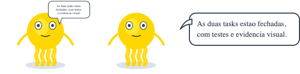
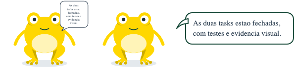
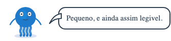

# 🧩 Task 168 — TaskinSays: o balao de fala em HTML, legivel em qualquer tamanho

- Status: in-progress
- Type: feat
- Assignee: sidartaveloso
- Group: movimentos-do-mascote
- Priority: 14330
- Difficulty: 3

## Description
O balao de fala em SVG (task-166) vive dentro do quadro de 320x260 do mascote: a 180px, o tamanho do chat, o texto sai com uns 6px e nao se le. Um componente TaskinSays envolve o Taskin e desenha o balao como HTML ancorado ao desenho, com texto em pixels de verdade, quebra de linha natural e cores do tema; o SVG continua para renders isolados.

## Tasks
<!-- [x] feito · [ ] em aberto · [ ] ... — adiado: <razão> para o que se decidiu não fazer -->
- [x] `TaskinSays.vue` em `packages/design-vue/src/components/organisms/taskin/`: envolve o `Taskin` e desenha o balao como HTML ao lado, na altura da cabeca, com rabicho em SVG inline apontando para ela; texto em pixels de verdade (15px por padrao), quebra natural, `max-width` pela prop `maxWidth` (260px); borda na tinta da variante (`MOUTH_INK`); pop de entrada com `animationsEnabled`, respeitando `prefers-reduced-motion`; cores trocaveis por `--taskin-says-bg`, `--taskin-says-ink`, `--taskin-says-text`, `--taskin-says-font-size`
- [x] Props proprias: `text`, `size`, `variant`, `animationsEnabled`, `maxWidth` (`TaskinSays.types.ts`). O resto (`mood`, `speaking`, `listening`, `juggling`, olhos...) atravessa para o `Taskin` como attrs; `class` e `style` ficam na raiz. Com texto, o balao de pensamento do SVG sai de cena (falar ganha de pensar). `play()` do `Taskin` de dentro exposto, para o `useTaskinScript`
- [x] Exports: `TaskinSays` e `TaskinSaysProps` no `organisms/taskin/index.ts` e no `src/index.ts`
- [x] Stories `Organisms/Taskin/Says`: Default (180px), Small (100px), LongText, Sapin, SemTexto, AntesEDepois (o mesmo texto no balao SVG e no HTML, lado a lado)
- [x] Testes `TaskinSays.spec.ts`: balao HTML fora do SVG; sem texto nao ha balao e o pensamento fica; com texto o pensamento some; fonte computada >= 14px com o mascote a 120px; borda na tinta de cada variante; attrs atravessam; `class`/`style` na raiz; `play` exposto. `pnpm --filter @opentask/taskin-design-vue test`: 679 + 306 passando
- [x] Evidencia visual em `TASKS/assets/task-168/` (`antes` = `speechText` em SVG; `depois` = `TaskinSays`; mesma frase, 180px, animacoes congeladas):
  - 
  - 
  - 
- [x] Changeset minor no `@opentask/taskin-design-vue` — `.changeset/taskin-says.md`
- [ ] Balao a esquerda (`placement: 'left'`) e balao acima do mascote — adiado: nenhuma superficie pede ainda; o chat usa a direita

## Notes
Nasce da comparacao de 04/10/2026 no chat: com o mascote a 180px, o balao SVG da task-166 nao se le. O SVG continua para renders isolados (landing, PWA, icones); em apps e no chat a fala e este componente. Irma da task-169.

### Verificacao
```bash
pnpm --filter @opentask/taskin-design-vue typecheck
pnpm --filter @opentask/taskin-design-vue lint
pnpm --filter @opentask/taskin-design-vue test
```
