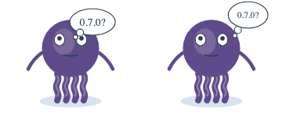
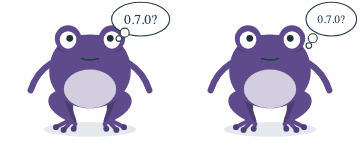
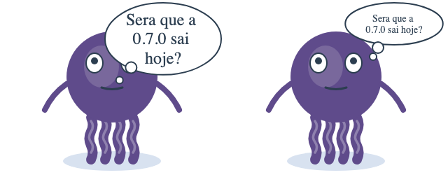
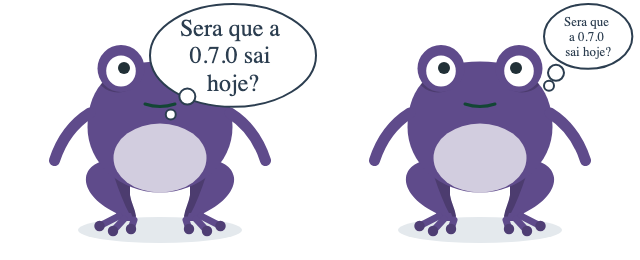

# 🧩 Task 169 — O balao de pensamento segue a regra do olho: cola no topo e desvia do olho direito

- Status: done
- Type: fix
- Assignee: sidartaveloso
- Group: movimentos-do-mascote
- Priority: 14340
- Difficulty: 2

## Description
O balao de pensamento nasce em cx 210, cy 50 e, com duas linhas, desce ate y 88, por cima do olho direito do Taskin (y 72 a 108); as bolinhas do rabicho caem na pupila. O balao de fala (task-166) ja cola no topo, para antes do olho e leva o rabicho ate a beira da cabeca a direita do olho. O de pensamento passa a seguir a mesma regra, pelo mesmo layoutBubble.

## Tasks
<!-- [x] feito · [ ] em aberto · [ ] ... — adiado: <razão> para o que se decidiu não fazer -->
- [x] `BUBBLE_ABOVE_EYE` e `BUBBLE_TIP` em `thought-bubble-layout.ts`: a geometria "acima do olho" que os dois baloes dividem (cola no topo, Taskin acaba antes de `TASKIN_EYE_TOP` = 72, Sapin inteiro a direita de `SAPIN_EYE_BUMP_RIGHT` = 222, fonte maxima 20, caixa curta a direita do rosto). `layoutThoughtBubble` passa a usa-la; `speech-bubble-layout.ts` deixa de ter a propria copia e ganha o limite certo do calombo do Sapin (antes 216, encostava nele)
- [x] `maxBottom` no `layoutBubble`: com `hugTop`, a fonte cede ate as linhas caberem acima do olho (tres linhas de 20px desciam ate `y` 93); so se nem a menor fonte couber e que o balao passa do limite
- [x] `thoughtTrail(layout, variant)`: as duas bolinhas descem da borda de baixo para o mesmo ponto do rabicho da fala, a direita do olho; antes eram proporcionais a elipse e caiam na pupila quando a frase crescia. `TaskinEffectThoughtBubble.ts` as desenha por ela
- [x] Specs atualizados para a geometria nova (`thought-bubble-layout.spec.ts`: Taskin em cx 243 / cy 34, Sapin em 268 / 34, fonte 20; `Taskin.spec.ts` › sapin) e novos: elipse acima do olho em quatro frases, a direita do calombo, bolinhas abaixo da borda e a direita do olho. `pnpm --filter @opentask/taskin-design-vue test`: 681 + 306 passando
- [x] Evidencia visual em `TASKS/assets/task-169/` (`antes` à esquerda, `depois` à direita; humor `thoughtful`, animacoes congeladas):
  -  
  - 
  - 
- [x] Changeset patch no `@opentask/taskin-design-vue` — `.changeset/pensamento-acima-do-olho.md`

## Notes
A troca: o balao de pensamento fica menor (fonte 20 em vez de 24, e cede mais cedo em frase longa) para nunca tapar o olho. Em tamanho de chat nenhum balao SVG se le; para isso existe o `TaskinSays` (task-168).

### Verificacao
```bash
pnpm --filter @opentask/taskin-design-vue typecheck
pnpm --filter @opentask/taskin-design-vue lint
pnpm --filter @opentask/taskin-design-vue test
```
