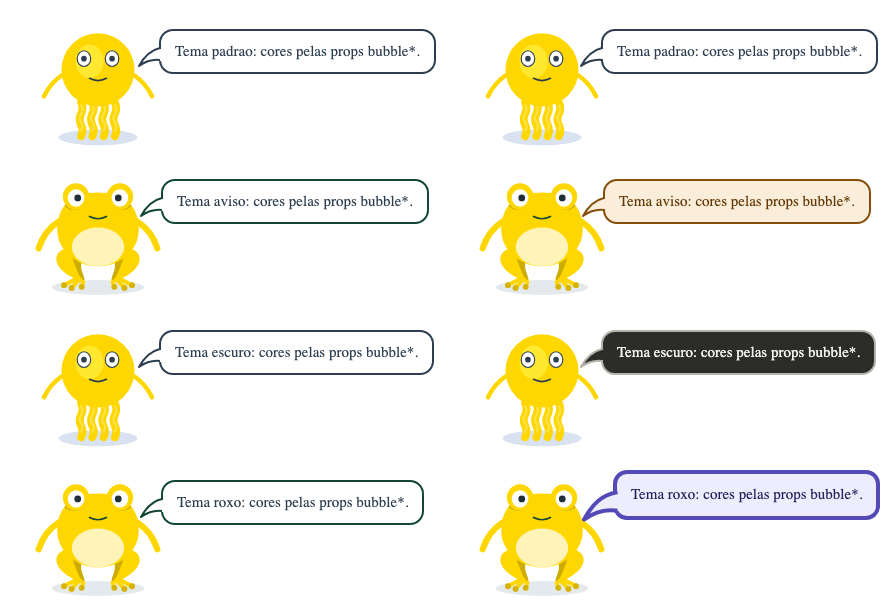
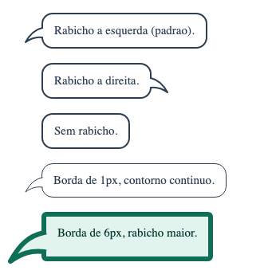
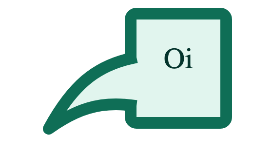
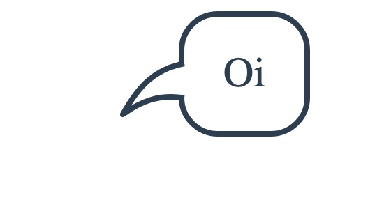

# 🧩 Task 170 — SpeechBubble: o balao vira atomo reutilizavel, com cores personalizaveis

- Status: in-progress
- Type: refactor
- Assignee: sidartaveloso
- Group: movimentos-do-mascote
- Priority: 14350
- Difficulty: 2

## Description
O balao HTML do TaskinSays (task-168) vive dentro do organismo, com as cores presas a variaveis CSS que so quem le o codigo descobre. Ele vira o atomo SpeechBubble: texto ou slot, rabicho a esquerda, a direita ou nenhum, e cores, borda, fonte, raio e largura por props, expostas como Controls no Storybook, sem perder o tema por variaveis CSS. O TaskinSays passa a usa-lo e repassa as cores.

## Tasks
<!-- [x] feito · [ ] em aberto · [ ] ... — adiado: <razão> para o que se decidiu não fazer -->
- [x] Atomo `SpeechBubble` em `packages/design-vue/src/components/atoms/speech-bubble/` (`SpeechBubble.vue`, `.types.ts`, `index.ts`), exportado por `atoms/index.ts`: texto pela prop `text` ou pelo slot padrao (o slot ganha); rabicho `tail: 'left' | 'right' | 'none'`, com `tailTop`; `animated` (pop de entrada, respeita `prefers-reduced-motion`); `class`, `role` e `data-*` de quem usa caem na raiz
- [x] Aparencia por props e por tema: `background`, `borderColor`, `textColor`, `borderWidth`, `fontSize`, `radius`, `maxWidth`. A prop, quando vem, vira a variavel `--speech-bubble-*` no proprio elemento e ganha; sem ela vale a variavel herdada de quem envolve; sem as duas, o padrao de antes (branco, `#2c3e50`, 2px, 15px, raio 14, 260px). `maxWidth` e a largura do texto (`box-sizing: content-box` explicito), como no `TaskinSays` de antes: as linhas quebram no mesmo lugar
- [x] O rabicho acompanha a borda: o SVG cresce com ela (`speechBubbleTailScale`: 1x ate 2px, 1,5x com 4px, 2x com 6px), a borda fica centrada na base dele em qualquer espessura, as curvas ganham um trecho reto ate a borda de dentro para a junta nao fazer degrau, e o fundo do rabicho apaga a borda entre elas (sai o retangulo da task-168). Com rabicho, o balao tem altura minima para a base caber na lateral; com borda de 6px e uma linha so, ela cortava a borda de baixo. `speechBubbleTailReach` e `speechBubbleTailDrop` dizem onde fica a ponta, para quem ancora o balao em algo
- [x] `TaskinSays` usa o atomo e ganha `bubbleBackground`, `bubbleBorderColor`, `bubbleTextColor`, `bubbleBorderWidth`, `bubbleFontSize`; sem `bubbleBorderColor`, a borda segue a tinta da variante, que entra como padrao do tema (o `style` de quem usa vem depois e ganha). O alcance e a queda do rabicho vem do atomo, com a espessura da borda
- [x] Stories com Controls: `Atoms/Base/SpeechBubble` (Default, TailRight, NoTail, Themes, ThemedByCssVariables, WithSlot; controles de cor, de faixa e de rabicho, 12 ao todo) e `Organisms/Taskin/Says` ganha os controles `bubble*` e as stories CustomColors e DarkBubble. Conferido no Storybook: os argumentos de cor mudam o balao ao vivo
- [x] Testes: `SpeechBubble.spec.ts` (texto e slot; padrao; props pintam caixa, borda, texto e rabicho; tema por variavel herdada e prop ganhando dele; os tres rabichos; borda centrada na base e alcance da ponta com 1, 2, 4 e 6px; base cabendo na lateral com 2, 4 e 6px; `tailTop` e `speechBubbleTailDrop`; pop; attrs na raiz) e `TaskinSays.spec.ts` (e o atomo; props `bubble*`; tema por variavel no `style` ganhando da variante). `pnpm --filter @opentask/taskin-design-vue test`: 701 + 314 passando
- [x] Evidencia visual em `TASKS/assets/task-170/`. O antes e o `TaskinSays` da task-168 (tirado do git, no commit a1ad2f8) recebendo as mesmas props de cor, que ele ignorava; o depois e o atual:
  - 
  - 
  -  
- [x] Changeset — `.changeset/speech-bubble-atomo.md` (minor)
- [ ] Rabicho em cima ou embaixo do balao — adiado: so os lados foram pedidos, e o `TaskinSays` fala de lado

## Notes
Pedido de 05/10/2026: as cores do balao devem ser personalizaveis, pelos Controls do Storybook, e o balao deve ser um atomo reutilizavel. As variaveis `--taskin-says-*` da task-168 nunca foram publicadas e deram lugar as `--speech-bubble-*`.

As evidencias de antes saem com a viewport do Vitest alargada (`page.viewport(1100, 1000)`): a padrao, de 414px, cortava os baloes a direita.

### Verificacao
```bash
pnpm --filter @opentask/taskin-design-vue typecheck
pnpm --filter @opentask/taskin-design-vue lint
pnpm --filter @opentask/taskin-design-vue test
```
