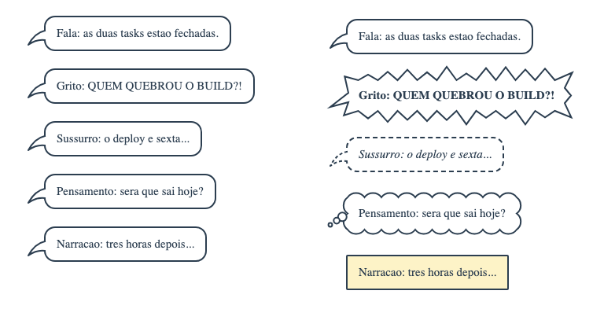
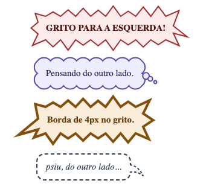
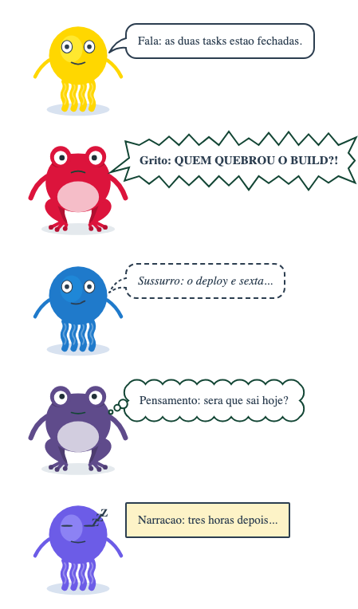

# 🧩 Task 171 — Os baloes dos quadrinhos: grito, sussurro, pensamento e narracao no SpeechBubble

- Status: in-progress
- Type: feat
- Assignee: sidartaveloso
- Group: movimentos-do-mascote
- Priority: 14360
- Difficulty: 3

## Description
O SpeechBubble (task-170) so sabe falar. Quadrinhos usam a forma do balao para dizer como se fala: grito com contorno em estrela, sussurro tracejado, pensamento em nuvem com bolinhas, narracao numa caixa sem rabicho. A prop kind escolhe a forma; o grito e o pensamento sao desenhados em SVG medido pelo tamanho do balao, com a ponta (ou a ultima bolinha) no mesmo lugar do rabicho de fala, para o TaskinSays continuar ancorando na cabeca. O TaskinSays repassa bubbleKind.

## Tasks
<!-- [x] feito · [ ] em aberto · [ ] ... — adiado: <razão> para o que se decidiu não fazer -->
- [x] Prop `kind` no `SpeechBubble` (`SPEECH_BUBBLE_KINDS`, tipo `SpeechBubbleKind`): `speech` (fala, a caixa de sempre), `shout` (grito), `whisper` (sussurro), `thought` (pensamento) e `narration` (narracao). Padrao `speech`, entao nada muda para quem ja usa
- [x] Grito e pensamento sao desenhados: a caixa guarda o tamanho (borda transparente) e um SVG por tras do texto, no tamanho medido dela (`ResizeObserver`, `offsetWidth`, que ignora o pop), desenha a forma com o fundo e a borda das props ou do tema. As formas sao funcoes puras em `speech-bubble-shapes.ts`: `shoutPoints`/`shoutOutline` (pontas alternadas em volta da caixa, poucas e grandes, de 55% a 145% de `spike`, sempre as mesmas para o mesmo balao, os cantos sempre pontas; o rabicho e mais uma ponta, longa) e `thoughtCloud` (gomos em arco, e tres bolinhas cada vez menores no lugar do rabicho)
- [x] A ponta do grito e a ultima bolinha do pensamento caem no mesmo ponto da ponta do rabicho de fala (`tailAnchor`, pelas mesmas `speechBubbleTailReach`/`Drop`): o `TaskinSays` ancora todos os modos na cabeca sem saber qual e
- [x] Sussurro: borda e rabicho tracejados, texto em italico. Narracao: canto reto (2px), fundo amarelado (`#fdf3c7`) e nunca rabicho; as props de cor e raio ainda ganham. Grito: texto em negrito
- [x] O atomo passa a abracar o texto (`width: fit-content`): solto num bloco, ocupava a largura maxima ate para "Oi"
- [x] `TaskinSays` ganha `bubbleKind`, repassado ao atomo
- [x] Documentation como a do Sapin (pedido de 05/10): descricao do componente, a grade com todos os modos no topo (`AllKinds`, com o nome de cada um) e uma story por modo, com descricao (`Speech`, `Shout`, `Whisper`, `Thought`, `Narration`), em `Atoms/Base/SpeechBubble` e em `Organisms/Taskin/Says` (este com o humor que combina com cada modo, alternando Taskin e Sapin). `kind` e `bubbleKind` nos Controls. Conferido na pagina Documentation do Storybook
- [x] Testes: `speech-bubble-shapes.spec.ts` (a ponta das formas e a do rabicho de fala com borda de 1 a 6px e a direita; o grito fecha, alterna pontas fora e pontos dentro, nenhuma ponta passa do `jitter`, o rabicho e uma ponta, e determinista, caixa baixa ainda tem rabicho; a nuvem tem gomos e fecha, as bolinhas diminuem ate a ponta, sem rabicho nao ha bolinhas), `SpeechBubble.spec.ts` › kind (classe de cada modo; grito e pensamento com caixa transparente e SVG do tamanho dela pintado pelas props; negrito; tres bolinhas; a forma acompanha o texto; sussurro tracejado e italico; narracao sem rabicho, reta e amarelada) e `TaskinSays.spec.ts` (`bubbleKind` chega ao balao). `pnpm --filter @opentask/taskin-design-vue test`: 730 + 325 passando
- [x] Evidencia visual em `TASKS/assets/task-171/`. O antes e o atomo da task-170 recebendo `kind`, que ele ignorava:
  - 
  - 
  - 
- [x] Changeset minor no `@opentask/taskin-design-vue` — `.changeset/baloes-dos-quadrinhos.md`
- [ ] Balao eletronico (robo, radio, telefone), com rabicho em raio — adiado: os cinco classicos primeiro; o eletronico pede um rabicho novo, e o Taskin e um robo, entao vale uma task propria
- [ ] Rabicho mais longo no grito, de quadrinho — adiado: hoje a ponta do rabicho do grito alcanca o mesmo ponto do rabicho de fala, para o `TaskinSays` ancorar igual; mais longo pede mudar a ancoragem

## Notes
Pedido de 05/10/2026: baloes diferentes para grito e outros estilos, como nos quadrinhos; e, no meio do trabalho, que a Documentation tenha todos os modos, como a do Sapin.

### Verificacao
```bash
pnpm --filter @opentask/taskin-design-vue typecheck
pnpm --filter @opentask/taskin-design-vue lint
pnpm --filter @opentask/taskin-design-vue test
```
