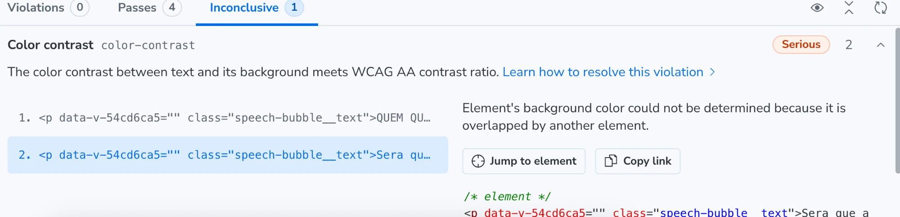
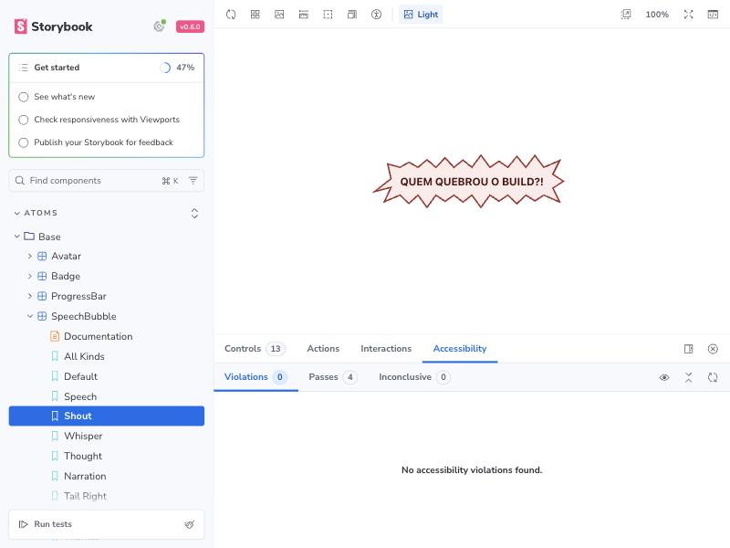
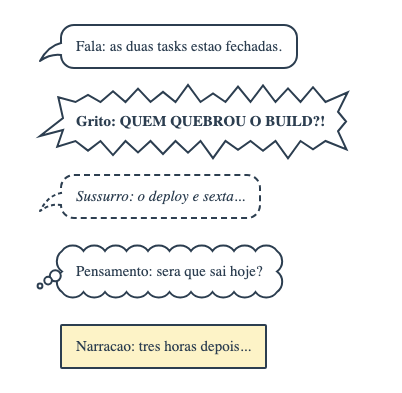

# 🧩 Task 172 — O contraste do grito e do pensamento fica mensuravel para o axe

- Status: in-progress
- Type: fix
- Assignee: sidartaveloso
- Group: movimentos-do-mascote
- Priority: 14370
- Difficulty: 1

## Description
No painel de acessibilidade do Storybook, o color-contrast do grito e do pensamento (task-171) sai Inconclusive: o fundo e desenhado por um SVG atras do texto, e o axe nao determina a cor de fundo de um elemento sobreposto. O texto passa a ter o proprio fundo, da mesma cor do balao e dentro da forma, e um teste roda o axe nos cinco modos.

## Tasks
<!-- [x] feito · [ ] em aberto · [ ] ... — adiado: <razão> para o que se decidiu não fazer -->
- [x] Reproduzido num teste antes de corrigir: `SpeechBubble.a11y.spec.ts` roda o `color-contrast` do axe (o mesmo do painel) em cada modo; o grito e o pensamento saiam `incomplete` com "Element's background color could not be determined because it is overlapped by another element", os outros tres passavam. `axe-core` 4.13.0 (a versao que o `@storybook/addon-a11y` ja trazia no lockfile) entra como devDependency do design-vue
- [x] Duas causas, duas correcoes, em `SpeechBubble.vue`: o texto do grito e do pensamento leva o proprio fundo, da cor do balao (o axe nao le o fundo de um SVG); e o empilhamento troca o `z-index: -1` do SVG pelo SVG no 0 e o texto, posicionado, no 1 (o navegador desenhava igual, mas o algoritmo de pilha do axe via o SVG por cima do texto). O paragrafo fica dentro do padding, e o padding dentro da forma, entao o fundo dele nao aparece
- [x] O desenho nao muda: a captura dos cinco modos, refeita com a mesma cena da task-171, deu 0 pixel diferente (`magick compare -metric AE`)
- [x] Testes: os cinco modos com contraste medido e passando, e o grito com cores proprias. `pnpm --filter @opentask/taskin-design-vue test`: 736 + 325 passando
- [x] Evidencia visual em `TASKS/assets/task-172/`:
  - antes, o painel com o contraste inconclusivo no grito e no pensamento: 
  - depois, o painel no grito, sem violacao nem inconclusivo: 
  - o desenho dos cinco modos, igual ao da task-171: 
- [x] Changeset patch — `.changeset/contraste-do-grito-mensuravel.md`
- [ ] Os tres "Z" do humor `sleeping` tambem saem inconclusivos ("conteudo curto demais"), na story `Says › All Kinds` — adiado: e o efeito `TaskinEffectZzz`, de antes dos baloes; fica para uma task propria

## Notes
Reportado em 05/10/2026 pela captura do painel de acessibilidade do Storybook, na story All Kinds do `SpeechBubble`.

### Verificacao
```bash
pnpm --filter @opentask/taskin-design-vue typecheck
pnpm --filter @opentask/taskin-design-vue lint
pnpm --filter @opentask/taskin-design-vue test
```
