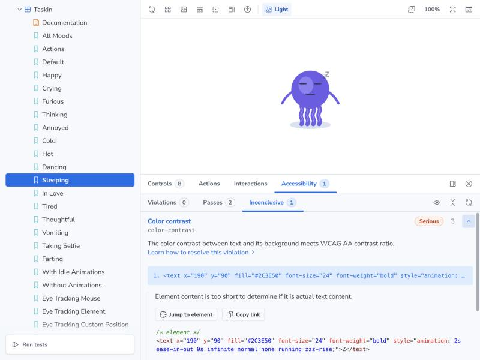
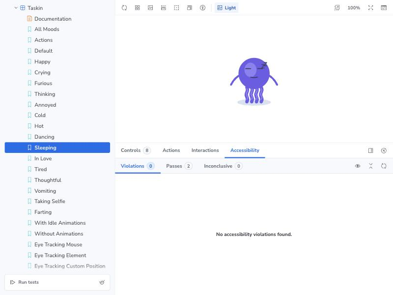
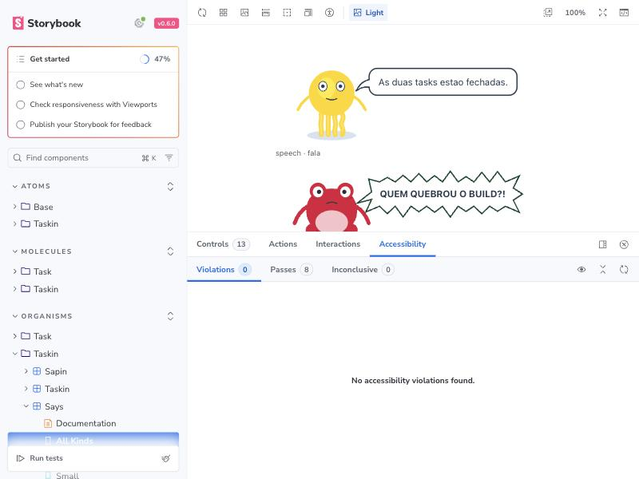
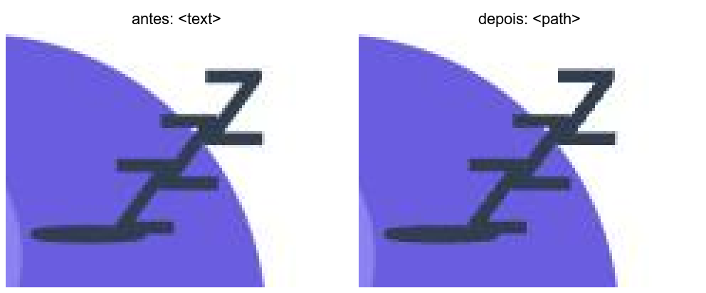

# 🧩 Task 173 — Os Z do sono deixam de sair inconclusivos no contraste do axe

- Status: done
- Type: fix
- Assignee: sidartaveloso
- Group: movimentos-do-mascote

## Description
No painel de acessibilidade do Storybook (addon-a11y, axe-core 4.13.0), o color-contrast dos tres Z do humor sleeping (TaskinEffectZzz) sai Inconclusive com 'Element content is too short to determine if it is actual text content'. Os Z sao decorativos: o efeito passa a ficar fora do que o axe mede, sem esconder conteudo real, e um teste roda o color-contrast do axe no Taskin dormindo.

## Tasks
<!-- [x] feito · [ ] em aberto · [ ] ... — adiado: <razão> para o que se decidiu não fazer -->
- [x] Reproduzido num teste antes de corrigir: `TaskinEffectZzz.a11y.spec.ts` monta o `Taskin` com mood `sleeping` (com e sem animacao) e roda `axe.run(elemento, { runOnly: ['color-contrast'] })`; os tres Z saiam `incomplete` com "Element content is too short to determine if it is actual text content"
- [x] Investigado no axe-core 4.13.0: a regra `color-contrast` tem `excludeHidden: false` e o matcher olha o texto visivel, nao a arvore de acessibilidade. Nem `aria-hidden` (no grupo ou no `<text>`) nem `role="presentation"` (idem) mudam o resultado, conferido num spec de rascunho, os quatro casos seguiam inconclusivos. O inconclusivo vem do `shortTextContent`: um caractere so, sobre o corpo roxo, onde o contraste nao fecha. O que tira o Z da regra e ele deixar de ser texto
- [x] Corrigido em `TaskinEffectZzz.ts`: cada Z vira um `<path>` com o contorno do glifo que o `<text>` desenhava (San Francisco bold 24px, medido no canvas do Storybook), com a origem na mesma linha de base. A animacao `zzz-rise` e o deslocamento por variante seguem iguais. Nao ha conteudo real escondido: os Z eram so desenho, e o `<text>` nao tinha nome acessivel util. Especificacoes do `TaskinEffectZzz` e do `Taskin` (sapin) passam a olhar o `path`
- [x] O desenho nao muda: rasterizado no canvas, o path difere do glifo em 1,2% dos pixels de tinta a 2x (so bordas de antialias); e o Z deixa de depender da fonte do sistema
- [x] Evidencia visual em `TASKS/assets/task-173/`:
  - antes, o painel com o contraste inconclusivo nos tres Z: 
  - depois, a story `Taskin › Sleeping` sem violacao nem inconclusivo: 
  - depois, a story `Says › All Kinds`, tambem zerada: 
  - os Z ampliados, `<text>` e `<path>` lado a lado: 
  - o Taskin dormindo inteiro, [antes](assets/task-173/antes-taskin-dormindo.jpg) e [depois](assets/task-173/depois-taskin-dormindo.jpg)
- [x] Changeset patch: `.changeset/os-z-do-sono-sem-inconclusivo.md`
- [x] Verificacao: typecheck e lint limpos; `test` com 738 + 325 passando

## Notes
Adiado da task-172, onde apareceu na story `Says › All Kinds` (linha da narracao).

### Verificacao
```bash
pnpm --filter @opentask/taskin-design-vue typecheck
pnpm --filter @opentask/taskin-design-vue lint
pnpm --filter @opentask/taskin-design-vue test
```
