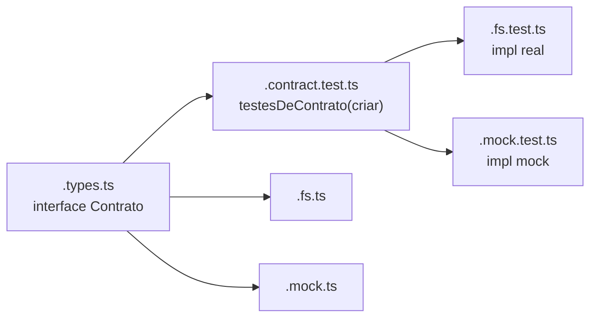

# Registro de Padrão Técnico — Estrutura de módulos (classe/serviço)

Tipo semântico:

`registro_padrao_tecnico`

## Propósito

Padronizar a organização de arquivos por classe ou serviço no código da
OpenTask, de modo que implementação, tipos, testes e mocks tenham lugar
previsível — e que múltiplas implementações de um mesmo contrato compartilhem
os testes. Precedente: o próprio taskin já usa isto (`hook-runner.ts` /
`.mock.ts` / `.test.ts`).

## A estrutura, por classe ou serviço

Cada classe ou serviço mora em uma **pasta com o seu nome** (kebab-case):

```
nome-da-classe-ou-servico/
  nome-da-classe-ou-servico.ts          # implementação
  nome-da-classe-ou-servico.types.ts    # tipos (interfaces, discriminated unions)
  nome-da-classe-ou-servico.test.ts     # testes da unidade
  nome-da-classe-ou-servico.mock.ts     # mock/fake, para uso pelos testes de OUTROS módulos
  index.ts                              # barrel: reexporta só a API pública
```

Nem todo arquivo é obrigatório: um serviço puro sem dependências pode dispensar
`.mock.ts`; um módulo só-de-tipos tem apenas `.types.ts` + `index.ts`.

## Múltiplas implementações → interface + contract test

Quando houver **mais de uma implementação** do mesmo contrato (ex.: uma real e
uma em memória):

1. O contrato é uma **interface** exportada em `.types.ts`.
2. Escreve-se `nome-da-classe-ou-servico.contract.test.ts` — um arquivo que
   **exporta uma função** com os testes de comportamento do contrato:
   ```ts
   export function testesDeContrato(criar: () => Contrato): void { /* it(...) */ }
   ```
3. O `.test.ts` de **cada implementação** importa e roda essa função contra a
   sua instância:
   ```ts
   // nome.fs.test.ts
   testesDeContrato(() => new NomeFs(dirTemporario))
   // nome.mock.test.ts
   testesDeContrato(() => new NomeMock())
   ```

Assim o comportamento é especificado uma vez e verificado em toda implementação
— nenhuma pode divergir do contrato sem quebrar o build.



## Tipagem

- **Discriminated unions** para estados e variantes — com campo discriminante
  explícito e exaustividade garantida por `casoImpossivel(x: never)` (ver
  [typestate-handles.md](./typestate-handles.md)).
- Sem `any`. Entrada externa entra como `unknown` e é estreitada.
- Tipos vivem em `.types.ts`; a implementação importa deles.

## Idioma

- **Português primeiro** em nomes de arquivo, pastas, funções, tipos e testes.
- **Inglês só em termos técnicos amplamente consagrados**: `test`, `mock`,
  `index`, `contract`, `types`, `interface`, `service`, `sync`, `build`.
- Exemplo: `sincronizador-taskin/sincronizador-taskin.ts`, classe
  `SincronizadorTaskin` com método `executar`, tipo `PlanoSync` (union
  discriminada por `acao`).

## Serviços são classes, e implementam uma interface

O comportamento vive em **classes** (não funções soltas), com dependências
injetadas no construtor (`constructor(private readonly repo: IRepositorioPacote)`).

Toda classe de serviço **implementa uma interface** declarada no `.types.ts`:

- A interface se chama `I<Nome>` (ex.: `IPlanejadorSync`, `IRepositorioPacote`)
  e fica **no topo do `.types.ts`, logo abaixo dos imports** — a leitura começa
  pelo contrato, não pelos detalhes.
- A classe `implements` a interface (`class PlanejadorSync implements IPlanejadorSync`).
- Múltiplas implementações usam o sufixo de variante: `RepositorioPacoteFs`,
  `RepositorioPacoteMock`, ambas `implements IRepositorioPacote`.
- As dependências de uma classe são tipadas pela **interface**, nunca pela
  implementação concreta.

Estilo *TypeScript Total*: os **tipos e nomes documentam** — evita-se comentário
ao máximo; um comentário é sinal de que um nome ou tipo poderia ser melhor.
